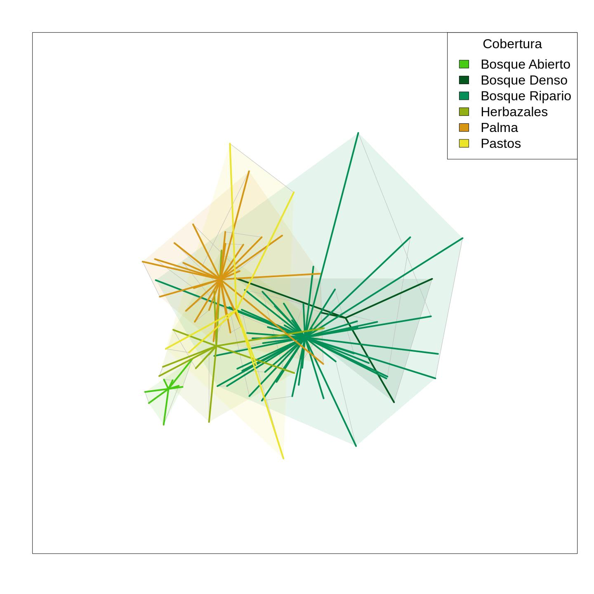

Análisis de los datos de aves
================
Marius Bottin
2023-04-20

- [1 Definición de las funciones](#1-definición-de-las-funciones)
  - [1.1 Función para formatear las
    matrices](#11-función-para-formatear-las-matrices)
  - [1.2 Función para guardar archivos
    excel](#12-función-para-guardar-archivos-excel)
  - [1.3 Función para las curvas de
    rango-abundancia](#13-función-para-las-curvas-de-rango-abundancia)
  - [1.4 Función para los perfiles de números efectivos de taxones
    (Hill)](#14-función-para-los-perfiles-de-números-efectivos-de-taxones-hill)
- [2 Importación de los datos de la base de
  datos](#2-importación-de-los-datos-de-la-base-de-datos)
- [3 Colores](#3-colores)
- [4 Información basica](#4-información-basica)
  - [4.1 Mapa de la zona](#41-mapa-de-la-zona)
    - [4.1.1 Adding ANH names](#411-adding-anh-names)
- [5 Definición de las categorias](#5-definición-de-las-categorias)
- [6 Curvas de diversidad](#6-curvas-de-diversidad)
  - [6.1 Estimación por sampling unit](#61-estimación-por-sampling-unit)
  - [6.2 Curvas y estimaciones por
    cobertura](#62-curvas-y-estimaciones-por-cobertura)
  - [6.3 Zonas](#63-zonas)
- [7 Perfiles de números de especies
  efectivas](#7-perfiles-de-números-de-especies-efectivas)
- [8 Curvas de rango Abundancia](#8-curvas-de-rango-abundancia)
  - [8.1 Matrix total](#81-matrix-total)
  - [8.2 Mostrando las zonas](#82-mostrando-las-zonas)
  - [8.3 Mostrando las coberturas](#83-mostrando-las-coberturas)
  - [8.4 Por coberturas](#84-por-coberturas)
    - [8.4.1 Bosque ripario](#841-bosque-ripario)
    - [8.4.2 Palma](#842-palma)
    - [8.4.3 Bosque Abierto](#843-bosque-abierto)
    - [8.4.4 Bosque Denso](#844-bosque-denso)
    - [8.4.5 Herbazales](#845-herbazales)
    - [8.4.6 Pastos](#846-pastos)
  - [8.5 Exportar los datos de los
    graficos](#85-exportar-los-datos-de-los-graficos)
- [9 Diversidad beta (NMDS)](#9-diversidad-beta-nmds)
  - [9.0.1 Representación basica](#901-representación-basica)
  - [9.0.2 Representación de las
    especies](#902-representación-de-las-especies)
  - [9.0.3 Representación de las unidades de
    muestreo](#903-representación-de-las-unidades-de-muestreo)
  - [9.0.4 Representación de las
    temporadas](#904-representación-de-las-temporadas)
  - [9.0.5 Representación de las
    coberturas](#905-representación-de-las-coberturas)
  - [9.0.6 Representación de las
    zonas](#906-representación-de-las-zonas)

------------------------------------------------------------------------

Se trata en este documento de presentar los análisis realizados sobre
los datos de aves, organizados en la base de datos

------------------------------------------------------------------------

# 1 Definición de las funciones

## 1.1 Función para formatear las matrices

``` r
# The dbTab2mat does something comparable to a 'dynamic table' of a
# famous spreadsheet application it takes a table with a column for
# sampling unit name (col_samplingUnits) a column for species names
# and a column for abundances (or presence absence: checklist=T) and
# makes a matrix of sampling units x species

dbTab2mat <- function(dbTab, col_samplingUnits = "SU", col_species = "sp",
    col_content = "abundance", empty = NA, checklist = F) {
    COLS <- unique(as.character(dbTab[, col_species]))
    ROWS <- unique(as.character(dbTab[, col_samplingUnits]))
    arr.which <- matrix(NA, ncol = 2, nrow = nrow(dbTab), dimnames = list(1:nrow(dbTab),
        c("row", "col")))
    arr.which[, 1] <- match(as.character(dbTab[, col_samplingUnits]), ROWS)
    arr.which[, 2] <- match(as.character(dbTab[, col_species]), COLS)
    modeContent <- ifelse(checklist, "logical", mode(dbTab[, col_content]))
    if (is.na(empty)) {
        empty <- switch(modeContent, character = "", numeric = 0, logical = F)
    }
    res <- matrix(empty, ncol = length(COLS), nrow = length(ROWS), dimnames = list(ROWS,
        COLS))
    if (checklist) {
        res[arr.which] <- T
    } else {
        res[arr.which] <- dbTab[, col_content]
    }
    return(res)
}
```

## 1.2 Función para guardar archivos excel

``` r
save_in_excel <- function(file, lVar) {
    if (!is.list(lVar)) {
        listVar <- mget(lVar, envir = .GlobalEnv)
    } else {
        listVar <- lVar
    }
    wb <- createWorkbook()
    for (i in 1:length(listVar)) {
        addWorksheet(wb, sheetName = names(listVar)[i])
        hasRownames <- !all(grepl("^[0-9]*$", rownames(listVar[[i]])))
        writeDataTable(wb, sheet = names(listVar)[i], listVar[[i]], rowNames = hasRownames)
        nCols <- ifelse(hasRownames, ncol(listVar[[i]]), ncol(listVar[[i]]))
        setColWidths(wb, sheet = names(listVar)[i], cols = 1:nCols, widths = "auto")
    }
    saveWorkbook(wb, file, overwrite = TRUE, )
}
```

## 1.3 Función para las curvas de rango-abundancia

``` r
# Funcion para hacer los graficos de -rango abundancia -rango
# incidencia -rango cobertura -rango densidad


# parameters: mat: abundance/incidence/cover/density matrix
# extraLines: factor in order to show extra rank abundance lines in
# the order of the main nbSp number of species in the main graph

rankAbundance <- function(mat, type = c("abundance", "incidence", "cover",
    "density"), nbSp = min(15, ncol(mat)), extraLines = NA, Ycalc = if (type ==
    "incidence") {
    identity
} else {
    log10
}, extraPch = 21, extraCol = rainbow(nlevels(extraLines)), borderLineCol = extraCol,
    legendOut = F, legendPlace = "topright", legend1 = "Total", legendTitle = NULL,
    legendInset = if (legendOut) {
        c(-0.3, 0)
    } else {
        c(0, 0)
    }, addProfiles = T, profilesOut = T, profilesOutFig = c(0.8, 0.99,
        0.25, 0.5), profilesInFigRatioX = 0.2, profilesInFigRatioY = 0.25,
    titleProfile = "Perfiles", labY = "Total abundance", calc = if (type %in%
        c("abundance", "incidence")) {
        colSums
    } else {
        colMeans
    }, MARG = c(10.1, 6.5, 1, ifelse(legendOut | profilesOut, 9, 1)), byTICK = 50,
    byLABELS = byTICK * 2, maxLABELS = 5e+05, pchMain = 15, colMain = "black",
    ltyMain = 2, ltyExtra = 3, posAxisX = 0, adjAxisX = 1.1, posNameSp = -0.25) {
    # Checking type
    type <- match.arg(type)
    # Checking compatibility between extraLines, colors and pch
    stopifnot(all(is.na(extraLines)) || length(extraPch) == 1 || length(extraPch) ==
        nlevels(extraLines))
    if (length(extraPch) == 1) {
        extraPch <- rep(extraPch, nlevels(extraLines))
    }
    stopifnot(all(is.na(extraLines)) || length(extraCol) == 1 || length(extraCol) ==
        nlevels(extraLines))
    if (length(extraCol) == 1) {
        extraCol <- rep(extraCol, nlevels(extraLines))
    }
    stopifnot(all(is.na(extraLines)) || length(borderLineCol) == 1 || length(borderLineCol) ==
        nlevels(extraLines))
    if (length(borderLineCol) == 1) {
        borderLineCol <- rep(borderLineCol, nlevels(extraLines))
    }
    # Calculation of main line values
    dataMain <- sort(calc(mat), decreasing = T)[1:nbSp]
    # Calculation of extra lines values
    if (!all(is.na(extraLines))) {
        b_dataExtra <- by(mat[, names(dataMain)], extraLines, calc)
        dataExtra <- Reduce(rbind, b_dataExtra[sapply(b_dataExtra, length) >
            0])
        rownames(dataExtra) <- names(b_dataExtra)[sapply(b_dataExtra, length) >
            0]
    } else {
        dataExtra <- matrix(1, nrow = 1, ncol = nbSp)
    }
    # Applying margins
    keepPar <- par(no.readonly = T)
    par(mar = MARG)
    # plot in case of log scale in Y

    # main line and plot coordinates
    plot(1:nbSp, Ycalc(dataMain), ylab = labY, xlab = NA, ylim = c(0, max(Ycalc(rbind(dataMain,
        dataExtra))) * 1.1), pch = pchMain, bty = "n", xaxt = "n", yaxt = "n",
        las = 2, type = "b", lty = ltyMain)
    # line of the taxon axis
    axis(side = 1, at = 1:nbSp, labels = FALSE, lwd.tick = -1, outer = T,
        pos = posAxisX)
    # names of the taxa
    text(x = (1:nbSp) + 0.2, y = posNameSp, names(dataMain), xpd = NA,
        srt = 45, adj = adjAxisX)
    # preparing the y axis
    ATX <- c(1, seq(byTICK, maxLABELS, byTICK))
    ATX <- ATX[1:(min(which(ATX > max(rbind(dataMain, dataExtra)))) + 1)]
    ATX <- unique(ATX[c(1, which(ATX%%byTICK == 0), length(ATX))])
    show <- c(T, ATX[2:(length(ATX) - 1)]%%byLABELS == 0, T)
    axis(side = 2, at = Ycalc(ATX), labels = ifelse(show, ATX, NA), las = 2)
    # Extra lines
    if (!all(is.na(extraLines))) {
        for (i in 1:nlevels(extraLines)) {
            lev <- levels(extraLines)[i]
            if (!lev %in% rownames(dataExtra)) {
                next
            }
            points(1:nbSp, Ycalc(dataExtra[lev, ]), pch = extraPch[i],
                col = borderLineCol[i], bg = extraCol[i], type = "b", lty = ltyExtra)
        }
    }

    # Legend
    if (!all(is.na(extraLines))) {
        if (legendOut) {
            par(xpd = T)
        }
        legend(legendPlace, pch = c(pchMain, extraPch[levels(extraLines) %in%
            unique(extraLines)]), col = c(colMain, borderLineCol[levels(extraLines) %in%
            unique(extraLines)]), pt.bg = c(colMain, extraCol[levels(extraLines) %in%
            unique(extraLines)]), legend = c(legend1, levels(extraLines)[levels(extraLines) %in%
            unique(extraLines)]), inset = legendInset, title = legendTitle,
            bty = "n")
    }
    # Inset profiles
    if (addProfiles == T) {
        if (profilesOut) {
            par(xpd = T)
            FIG <- profilesOutFig
        } else {
            FIG <- c(grconvertX(0.05 + c(0, profilesInFigRatioX), from = "npc",
                to = "ndc"), grconvertY(0.05 + c(0, profilesInFigRatioY),
                from = "npc", to = "ndc"))
        }
        par(fig = FIG, new = T, mar = c(0.05, 0, 0.7, 0), oma = c(0, 0,
            0, 0))
        tot_calc_profiles <- sort(calc(mat), decreasing = T)
        if (!all(is.na(extraLines))) {
            cat_calc_profiles <- by(mat, extraLines, function(x) sort(calc(x)[calc(x) >
                0], decreasing = T))
            plot(x = 1:ncol(mat), y = Ycalc(tot_calc_profiles), type = "l",
                ylim = range(Ycalc(Reduce(c, c(tot_calc_profiles, cat_calc_profiles)))),
                bty = "n", lwd = 1.2, xaxt = "n", yaxt = "n", main = titleProfile)
            axis(1, at = seq(0, ncol(mat)), labels = F, lwd.ticks = -1,
                pos = min(Ycalc(Reduce(c, c(tot_calc_profiles, cat_calc_profiles)))))
            axis(2, at = c(min(Ycalc(Reduce(c, c(tot_calc_profiles, cat_calc_profiles)))),
                Ycalc(ATX)), labels = F, tck = -0.05)
            for (i in 1:nlevels(extraLines)) {
                lev <- levels(extraLines)[i]
                if (!lev %in% unique(extraLines)) {
                  next
                }
                points(x = 1:length(cat_calc_profiles[[i]]), y = Ycalc(cat_calc_profiles[[i]]),
                  col = extraCol[i], type = "l")
            }
        } else {
            plot(x = 1:ncol(mat), y = Ycalc(tot_calc_profiles), type = "l",
                bty = "n", lwd = 1.2, xaxt = "n", yaxt = "n", main = titleProfile)
            axis(1, at = seq(0, ncol(mat)), labels = F, lwd.ticks = -1,
                pos = min(Ycalc(tot_calc_profiles[tot_calc_profiles > 0])))
            axis(2, at = c(min(Ycalc(tot_calc_profiles[tot_calc_profiles >
                0])), Ycalc(ATX)), labels = F, tck = -0.05)
        }
        # if(delimPerfil){
        # segments(0,nbSp,max(c(Ycalc(posAxisX),0.00000001),na.rm =
        # T),max(c(Ycalc(posAxisX),0.0000001),na.rm =
        # T),col='grey',2)
        # segments(nbSp,nbSp,0,max(Ycalc(rbind(dataMain,dataExtra)))*1.1)
        # }
    }
    par(keepPar)
    if (!all(is.na(extraLines))) {
        return(rbind(Total = dataMain, dataExtra))
    } else {
        return(dataMain)
    }
}
```

## 1.4 Función para los perfiles de números efectivos de taxones (Hill)

``` r
effectiveTaxNbProfile <- function(iNEXT_tot, iNEXT_categ = NULL, colTotal = "black",
    colCateg = rainbow(length(categLevels)), categLevels = names(colCateg),
    colErrorBar = "darkgrey", YLAB = "Número efectivo de especies (Hill)",
    titleLegend = "Cobertura") {
    est_tot <- iNEXT_tot$AsyEst
    mat_barplot <- matrix(est_tot$Estimator, ncol = 3, dimnames = list(c("Total"),
        c("Q0 (richness)", "Q1 (Shannon)", "Q2 (Simpson)")))
    mat_lower <- matrix(est_tot$`95% Lower`, ncol = 3)
    mat_upper <- matrix(est_tot$`95% Upper`, ncol = 3)
    if (!is.null(iNEXT_categ)) {
        est_categ <- iNEXT_categ$AsyEst
        est_categ$Assemblage <- factor(est_categ$Assemblage, levels = categLevels)
        mat_barplot <- rbind(mat_barplot, Reduce(rbind, by(est_categ, est_categ$Assemblage,
            function(x) matrix(x$Estimator, ncol = 3, dimnames = list(unique(x$Assemblage),
                c("Q0 (richness)", "Q1 (Shannon)", "Q2 (Simpson)"))))))
        mat_lower <- rbind(mat_lower, Reduce(rbind, by(est_categ, est_categ$Assemblage,
            function(x) matrix(x$LCL, ncol = 3, dimnames = list(unique(x$Assemblage),
                c("Q0 (richness)", "Q1 (Shannon)", "Q2 (Simpson)"))))))
        mat_upper <- rbind(mat_upper, Reduce(rbind, by(est_categ, est_categ$Assemblage,
            function(x) matrix(x$UCL, ncol = 3, dimnames = list(unique(x$Assemblage),
                c("Q0 (richness)", "Q1 (Shannon)", "Q2 (Simpson)"))))))
        mat_barplot[is.na(mat_barplot)] <- 0
        mat_lower[is.na(mat_barplot) | is.na(mat_lower)] <- 0
        mat_upper[is.na(mat_barplot) | is.na(mat_upper)] <- 0
    }
    A <- barplot(mat_barplot, beside = T, ylim = c(0, max(mat_upper)),
        col = c(colTotal, colCateg[categLevels %in% rownames(mat_barplot)]),
        legend = T, args.legend = list(bty = "n", title = titleLegend),
        ylab = YLAB, las = 1)
    segments(A, mat_lower, A, mat_upper, col = colErrorBar, lwd = 2)
    segments(A - 0.1, mat_lower, A + 0.1, mat_lower, col = colErrorBar,
        lwd = 2)
    segments(A - 0.1, mat_upper, A + 0.1, mat_upper, col = colErrorBar,
        lwd = 2)
}
```

# 2 Importación de los datos de la base de datos

La base de datos contiene todos los datos de aves en VIEWS del schema
“public”, se pueden importar así:

``` r
(listTable <- dbGetQuery(fracking_db, "SELECT table_name FROM information_schema.tables WHERE table_schema='public' AND table_name ~ '^aves'")$table_name)
```

    ## [1] "aves_info_sampling_point_count"  "aves_point_count_matrix"        
    ## [3] "aves_point_count_puresum_matrix"

``` r
import_aves <- lapply(listTable, dbReadTable, conn = fracking_db)
names(import_aves) <- listTable
import_aves[grep("matrix", listTable)] <- lapply(import_aves[grep("matrix",
    listTable)], function(x) {
    col_content <- c("abundance", "density", "incidence")[c("abundance",
        "density", "incidence") %in% colnames(x)]
    o_checklist <- !as.logical(length(col_content))
    dbTab2mat(x, col_samplingUnits = "anh_tempo", col_species = "taxon",
        col_content = col_content, empty = 0, checklist = o_checklist)
})
```

# 3 Colores

``` r
fol_data <- "../../../bpw_data_repo/colors/"
wb <- loadWorkbook(file.path(fol_data, "Colores.xlsx"))
colList <- lapply(names(wb), read.xlsx, xlsxFile = file.path(fol_data,
    "Colores.xlsx"))
names(colList) <- names(wb)
colList$zonas <- colList$zonas[order(colList$zonas$platform), ]
colList$landcover <- colList$landcover[order(colList$landcover$landcov_spa),
    ]
```

# 4 Información basica

## 4.1 Mapa de la zona

``` r
require(rpostgis)
```

    ## Loading required package: rpostgis

``` r
require(sp)
```

    ## Loading required package: sp

``` r
zonas <- pgGetGeom(fracking_db, query = "SELECT platform,zona_geom AS geom FROM main.platform")
```

    ## Returning Polygon types in SpatialPolygons*-class.

``` r
landcov <- pgGetGeom(fracking_db, query = "SELECT cd_landcov,landcov,landcov_spa,the_geom AS geom FROM spat.landcov LEFT JOIN spat.def_landcov USING (cd_landcov)")
```

    ## Returning Polygon types in SpatialPolygons*-class.

``` r
plot(zonas, col = NA)
plot(landcov, col = colList$landcover$color[match(landcov@data$cd_landcov,
    table = colList$landcover$cd_landcov)], border = NA, add = T)
plot(zonas, col = NA, border = "black", add = T)
infoTot <- import_aves$aves_info_sampling_point_count
coordinates(infoTot) <- ~x_coord_centroid + y_coord_centroid
plot(infoTot, bg = colList$landcover$color[match(infoTot$landcov_spa, table = colList$landcover$landcov_spa)],
    cex = 2, pch = 22, add = T)
legend("topright", fill = colList$landcover$color, legend = colList$landcover$landcov_spa,
    title = "Cobertura", border = NA, bty = "n")
```

<!-- -->

### 4.1.1 Adding ANH names

``` r
library(raster)
SQL <- "SELECT name_pt_ref,ST_centroid(ST_collect(pt_geom)) geom
FROM main.event
LEFT JOIN main.gp_event USING (cd_gp_event)
LEFT JOIN main.def_protocol USING (cd_protocol)
LEFT JOIN main.punto_referencia USING (cd_pt_ref)
WHERE cd_gp_biol='aves' AND protocol='Bird point count'
GROUP BY name_pt_ref
"
pt_ref_labels <- pgGetGeom(fracking_db, query = SQL)
```

    ## Returning Point types in SpatialPoints*-class.

``` r
plot(zonas, col = NA)
plot(landcov, col = colList$landcover$color[match(landcov@data$cd_landcov,
    table = colList$landcover$cd_landcov)], border = NA, add = T)
plot(zonas, col = NA, border = "black", add = T)
plot(infoTot, bg = colList$landcover$color[match(infoTot$landcov_spa, table = colList$landcover$landcov_spa)],
    cex = 2, pch = 22, add = T)
text(pt_ref_labels, pt_ref_labels$name_pt_ref, col = "black", halo = T,
    cex = 0.7, pos = 3)
legend("topright", fill = colList$landcover$color, legend = colList$landcover$landcov_spa,
    title = "Cobertura", border = NA, bty = "n")
```

<!-- -->

# 5 Definición de las categorias

``` r
aves_matrix <- import_aves$aves_point_count_matrix
infoTot <- import_aves$aves_info_sampling_point_count
m <- match(rownames(aves_matrix), table = infoTot$anh_tempo)
anh <- as.numeric(gsub("ANH_([0-9]{1,3})_(T[12])", "\\1", rownames(aves_matrix)))
tempo <- factor(gsub("ANH_([0-9]{1,3})_(T[12])", "\\2", rownames(aves_matrix)),
    levels = colList$tempo$cd_tempo, labels = colList$tempo$temporada)
table(tempo)
```

    ## tempo
    ## Aguas altas Aguas bajas 
    ##          50          56

``` r
zona <- factor(infoTot$zone[m], levels = colList$zonas$platform)
table(zona, tempo)
```

    ##                  tempo
    ## zona              Aguas altas Aguas bajas
    ##   Caracterización          10          13
    ##   Kalé                     22          22
    ##   Platero                  18          21

``` r
landcov <- factor(infoTot$landcov_spa[m], levels = colList$landcover$landcov_spa)
table(landcov, tempo)
```

    ##                      tempo
    ## landcov               Aguas altas Aguas bajas
    ##   Bosque Abierto                4           4
    ##   Bosque Denso                  2           2
    ##   Bosque Ripario               22          28
    ##   Cuerpos Agua                  0           0
    ##   Cultivos                      0           0
    ##   Herbazales                    5           5
    ##   Otros                         0           0
    ##   Palma                        14          14
    ##   Pastos                        3           3
    ##   Plantación Forestal           0           0
    ##   Urbano                        0           0
    ##   Vias                          0           0
    ##   Zonas Pantanosas              0           0

``` r
table(landcov, zona)
```

    ##                      zona
    ## landcov               Caracterización Kalé Platero
    ##   Bosque Abierto                    0    8       0
    ##   Bosque Denso                      4    0       0
    ##   Bosque Ripario                   11   22      17
    ##   Cuerpos Agua                      0    0       0
    ##   Cultivos                          0    0       0
    ##   Herbazales                        0    6       4
    ##   Otros                             0    0       0
    ##   Palma                             4    8      16
    ##   Pastos                            4    0       2
    ##   Plantación Forestal               0    0       0
    ##   Urbano                            0    0       0
    ##   Vias                              0    0       0
    ##   Zonas Pantanosas                  0    0       0

``` r
# Cuales son las unidades de muestreo sin registros:
infoTot$anh_tempo[!infoTot$anh_tempo %in% infoTot$anh_tempo[m]]
```

    ## character(0)

# 6 Curvas de diversidad

------------------------------------------------------------------------

**Anotar: para realizar el documento rápidamente, utilizo acá las
abundancias tal como calculadas para hacer la matriz de datos de aves.
Sin embargo es posible que el modo de calculo de las abundancias
introduzca un sesgo en las estimaciones de diversidad. Tengo que tomar
un tiempo de reflexión para pensarlo… En 1/2 días volveré con una
decisión de como tratar esos datos en el marco de la estimación de
diversidad…**

**SOLUCIÓN: finalmente creé una segunda matriz “puresum” que hace una
suma simple del número de individuos observados en los puntos fijos.
Todos los calculos iNEXT van a estar con está matriz, aúnque las NMDS y
curvas de rango-abundancia van a utilizar la matriz que utiliza los
maximos por replicaciones de punto fijo**

------------------------------------------------------------------------

``` r
aves_matrix <- import_aves$aves_point_count_puresum_matrix
```

## 6.1 Estimación por sampling unit

``` r
dataFor_iNEXT_SU <- apply(aves_matrix, 1, function(x) sort(x[x > 0], decreasing = T))
iNEXT_SU <- iNEXT(x = dataFor_iNEXT_SU, datatype = "abundance")
```

<table class="table" style="margin-left: auto; margin-right: auto;">
<caption>

Estimaciones de diversidad por unidad de muestreo

</caption>
<thead>
<tr>
<th style="empty-cells: hide;border-bottom:hidden;" colspan="2">
</th>
<th style="border-bottom:hidden;padding-bottom:0; padding-left:3px;padding-right:3px;text-align: center; " colspan="2">

<div style="border-bottom: 1px solid #ddd; padding-bottom: 5px; ">

q0 (riqueza)

</div>

</th>
<th style="border-bottom:hidden;padding-bottom:0; padding-left:3px;padding-right:3px;text-align: center; " colspan="2">

<div style="border-bottom: 1px solid #ddd; padding-bottom: 5px; ">

q1 (Shannon)

</div>

</th>
<th style="border-bottom:hidden;padding-bottom:0; padding-left:3px;padding-right:3px;text-align: center; " colspan="2">

<div style="border-bottom: 1px solid #ddd; padding-bottom: 5px; ">

q2 (Simpson)

</div>

</th>
</tr>
<tr>
<th style="text-align:left;">

anh_tempo

</th>
<th style="text-align:right;">

coverage

</th>
<th style="text-align:right;">

observado

</th>
<th style="text-align:left;">

estimado

</th>
<th style="text-align:right;">

observado

</th>
<th style="text-align:left;">

estimado

</th>
<th style="text-align:right;">

observado

</th>
<th style="text-align:left;">

estimado

</th>
</tr>
</thead>
<tbody>
<tr>
<td style="text-align:left;">

ANH_128_T1

</td>
<td style="text-align:right;">

0.8341

</td>
<td style="text-align:right;">

33

</td>
<td style="text-align:left;">

70.08 ± 29.3

</td>
<td style="text-align:right;">

24.54

</td>
<td style="text-align:left;">

35.5 ± 5.59

</td>
<td style="text-align:right;">

18.58

</td>
<td style="text-align:left;">

23.15 ± 3.91

</td>
</tr>
<tr>
<td style="text-align:left;">

ANH_128_T2

</td>
<td style="text-align:right;">

0.8094

</td>
<td style="text-align:right;">

17

</td>
<td style="text-align:left;">

56.64 ± 28.54

</td>
<td style="text-align:right;">

12.20

</td>
<td style="text-align:left;">

19.3 ± 5.62

</td>
<td style="text-align:right;">

9.48

</td>
<td style="text-align:left;">

11.62 ± 2.59

</td>
</tr>
<tr>
<td style="text-align:left;">

ANH_154_T1

</td>
<td style="text-align:right;">

0.8317

</td>
<td style="text-align:right;">

21

</td>
<td style="text-align:left;">

26.22 ± 7.27

</td>
<td style="text-align:right;">

18.11

</td>
<td style="text-align:left;">

24.85 ± 2.9

</td>
<td style="text-align:right;">

16.03

</td>
<td style="text-align:left;">

24.07 ± 3.33

</td>
</tr>
<tr>
<td style="text-align:left;">

ANH_154_T2

</td>
<td style="text-align:right;">

0.7356

</td>
<td style="text-align:right;">

17

</td>
<td style="text-align:left;">

29.16 ± 13.02

</td>
<td style="text-align:right;">

12.22

</td>
<td style="text-align:left;">

18.73 ± 3.95

</td>
<td style="text-align:right;">

9.07

</td>
<td style="text-align:left;">

11.68 ± 3.25

</td>
</tr>
<tr>
<td style="text-align:left;">

ANH_169_T1

</td>
<td style="text-align:right;">

0.9211

</td>
<td style="text-align:right;">

44

</td>
<td style="text-align:left;">

49.5 ± 6.06

</td>
<td style="text-align:right;">

31.35

</td>
<td style="text-align:left;">

37.62 ± 2.91

</td>
<td style="text-align:right;">

22.87

</td>
<td style="text-align:left;">

26.8 ± 3.21

</td>
</tr>
<tr>
<td style="text-align:left;">

ANH_169_T2

</td>
<td style="text-align:right;">

0.7569

</td>
<td style="text-align:right;">

56

</td>
<td style="text-align:left;">

130.39 ± 40.53

</td>
<td style="text-align:right;">

44.47

</td>
<td style="text-align:left;">

73.52 ± 9.4

</td>
<td style="text-align:right;">

36.63

</td>
<td style="text-align:left;">

51.74 ± 6.11

</td>
</tr>
<tr>
<td style="text-align:left;">

ANH_185_T1

</td>
<td style="text-align:right;">

0.9272

</td>
<td style="text-align:right;">

40

</td>
<td style="text-align:left;">

45.01 ± 11.45

</td>
<td style="text-align:right;">

28.45

</td>
<td style="text-align:left;">

33.6 ± 2.15

</td>
<td style="text-align:right;">

22.00

</td>
<td style="text-align:left;">

25.64 ± 2.38

</td>
</tr>
<tr>
<td style="text-align:left;">

ANH_185_T2

</td>
<td style="text-align:right;">

0.8593

</td>
<td style="text-align:right;">

34

</td>
<td style="text-align:left;">

55.14 ± 13.38

</td>
<td style="text-align:right;">

21.33

</td>
<td style="text-align:left;">

27.73 ± 3.66

</td>
<td style="text-align:right;">

15.04

</td>
<td style="text-align:left;">

17.2 ± 2.36

</td>
</tr>
<tr>
<td style="text-align:left;">

ANH_189_T1

</td>
<td style="text-align:right;">

0.8905

</td>
<td style="text-align:right;">

9

</td>
<td style="text-align:left;">

11.16 ± 6.22

</td>
<td style="text-align:right;">

7.09

</td>
<td style="text-align:left;">

8.87 ± 1.99

</td>
<td style="text-align:right;">

5.83

</td>
<td style="text-align:left;">

7.22 ± 1.82

</td>
</tr>
<tr>
<td style="text-align:left;">

ANH_189_T2

</td>
<td style="text-align:right;">

0.6999

</td>
<td style="text-align:right;">

21

</td>
<td style="text-align:left;">

62.27 ± 46.43

</td>
<td style="text-align:right;">

16.14

</td>
<td style="text-align:left;">

30.09 ± 11.69

</td>
<td style="text-align:right;">

12.75

</td>
<td style="text-align:left;">

17.71 ± 4.76

</td>
</tr>
<tr>
<td style="text-align:left;">

ANH_191_T1

</td>
<td style="text-align:right;">

0.9608

</td>
<td style="text-align:right;">

43

</td>
<td style="text-align:left;">

46.67 ± 5.81

</td>
<td style="text-align:right;">

26.83

</td>
<td style="text-align:left;">

29.99 ± 1.68

</td>
<td style="text-align:right;">

18.77

</td>
<td style="text-align:left;">

20.37 ± 1.89

</td>
</tr>
<tr>
<td style="text-align:left;">

ANH_191_T2

</td>
<td style="text-align:right;">

0.9172

</td>
<td style="text-align:right;">

44

</td>
<td style="text-align:left;">

57.98 ± 11.73

</td>
<td style="text-align:right;">

29.41

</td>
<td style="text-align:left;">

35.11 ± 2.75

</td>
<td style="text-align:right;">

21.72

</td>
<td style="text-align:left;">

24.56 ± 2.52

</td>
</tr>
<tr>
<td style="text-align:left;">

ANH_192_T1

</td>
<td style="text-align:right;">

0.9935

</td>
<td style="text-align:right;">

54

</td>
<td style="text-align:left;">

57.55 ± 4.43

</td>
<td style="text-align:right;">

7.23

</td>
<td style="text-align:left;">

7.41 ± 0.42

</td>
<td style="text-align:right;">

2.65

</td>
<td style="text-align:left;">

2.66 ± 0.12

</td>
</tr>
<tr>
<td style="text-align:left;">

ANH_192_T2

</td>
<td style="text-align:right;">

0.9736

</td>
<td style="text-align:right;">

46

</td>
<td style="text-align:left;">

54.43 ± 7.62

</td>
<td style="text-align:right;">

9.83

</td>
<td style="text-align:left;">

10.45 ± 1.0

</td>
<td style="text-align:right;">

3.68

</td>
<td style="text-align:left;">

3.7 ± 0.34

</td>
</tr>
<tr>
<td style="text-align:left;">

ANH_197_T1

</td>
<td style="text-align:right;">

0.9495

</td>
<td style="text-align:right;">

57

</td>
<td style="text-align:left;">

65.62 ± 8.71

</td>
<td style="text-align:right;">

33.91

</td>
<td style="text-align:left;">

38.33 ± 2.54

</td>
<td style="text-align:right;">

22.80

</td>
<td style="text-align:left;">

24.63 ± 2.32

</td>
</tr>
<tr>
<td style="text-align:left;">

ANH_197_T2

</td>
<td style="text-align:right;">

0.9020

</td>
<td style="text-align:right;">

45

</td>
<td style="text-align:left;">

64.95 ± 16.02

</td>
<td style="text-align:right;">

24.33

</td>
<td style="text-align:left;">

29.28 ± 2.73

</td>
<td style="text-align:right;">

15.26

</td>
<td style="text-align:left;">

16.48 ± 1.87

</td>
</tr>
<tr>
<td style="text-align:left;">

ANH_208_T1

</td>
<td style="text-align:right;">

0.8475

</td>
<td style="text-align:right;">

13

</td>
<td style="text-align:left;">

30.54 ± 11.88

</td>
<td style="text-align:right;">

9.50

</td>
<td style="text-align:left;">

13.42 ± 2.8

</td>
<td style="text-align:right;">

7.49

</td>
<td style="text-align:left;">

9.04 ± 1.72

</td>
</tr>
<tr>
<td style="text-align:left;">

ANH_208_T2

</td>
<td style="text-align:right;">

0.9623

</td>
<td style="text-align:right;">

12

</td>
<td style="text-align:left;">

12.65 ± 3.74

</td>
<td style="text-align:right;">

8.54

</td>
<td style="text-align:left;">

9.71 ± 1.22

</td>
<td style="text-align:right;">

6.25

</td>
<td style="text-align:left;">

7.0 ± 1.45

</td>
</tr>
<tr>
<td style="text-align:left;">

ANH_211_T1

</td>
<td style="text-align:right;">

0.7463

</td>
<td style="text-align:right;">

13

</td>
<td style="text-align:left;">

24.8 ± 10.11

</td>
<td style="text-align:right;">

10.71

</td>
<td style="text-align:left;">

17.07 ± 3.98

</td>
<td style="text-align:right;">

9.23

</td>
<td style="text-align:left;">

13.5 ± 3.27

</td>
</tr>
<tr>
<td style="text-align:left;">

ANH_211_T2

</td>
<td style="text-align:right;">

0.8209

</td>
<td style="text-align:right;">

27

</td>
<td style="text-align:left;">

38.82 ± 14.73

</td>
<td style="text-align:right;">

20.89

</td>
<td style="text-align:left;">

28.92 ± 3.94

</td>
<td style="text-align:right;">

16.63

</td>
<td style="text-align:left;">

21.89 ± 3.61

</td>
</tr>
<tr>
<td style="text-align:left;">

ANH_213_T1

</td>
<td style="text-align:right;">

0.9360

</td>
<td style="text-align:right;">

13

</td>
<td style="text-align:left;">

20.87 ± 7.72

</td>
<td style="text-align:right;">

8.60

</td>
<td style="text-align:left;">

10.12 ± 1.73

</td>
<td style="text-align:right;">

6.08

</td>
<td style="text-align:left;">

6.64 ± 1.32

</td>
</tr>
<tr>
<td style="text-align:left;">

ANH_213_T2

</td>
<td style="text-align:right;">

0.9457

</td>
<td style="text-align:right;">

19

</td>
<td style="text-align:left;">

27.1 ± 13.57

</td>
<td style="text-align:right;">

9.11

</td>
<td style="text-align:left;">

10.2 ± 1.0

</td>
<td style="text-align:right;">

6.01

</td>
<td style="text-align:left;">

6.26 ± 0.68

</td>
</tr>
<tr>
<td style="text-align:left;">

ANH_218_T1

</td>
<td style="text-align:right;">

0.8930

</td>
<td style="text-align:right;">

19

</td>
<td style="text-align:left;">

29.52 ± 13.19

</td>
<td style="text-align:right;">

11.50

</td>
<td style="text-align:left;">

14.2 ± 2.37

</td>
<td style="text-align:right;">

7.91

</td>
<td style="text-align:left;">

8.74 ± 1.52

</td>
</tr>
<tr>
<td style="text-align:left;">

ANH_218_T2

</td>
<td style="text-align:right;">

0.8988

</td>
<td style="text-align:right;">

11

</td>
<td style="text-align:left;">

18.79 ± 6.48

</td>
<td style="text-align:right;">

8.63

</td>
<td style="text-align:left;">

10.9 ± 1.8

</td>
<td style="text-align:right;">

7.49

</td>
<td style="text-align:left;">

9.04 ± 1.28

</td>
</tr>
<tr>
<td style="text-align:left;">

ANH_220_T1

</td>
<td style="text-align:right;">

0.8884

</td>
<td style="text-align:right;">

12

</td>
<td style="text-align:left;">

18.11 ± 9.51

</td>
<td style="text-align:right;">

7.23

</td>
<td style="text-align:left;">

8.96 ± 2.05

</td>
<td style="text-align:right;">

4.72

</td>
<td style="text-align:left;">

5.17 ± 1.23

</td>
</tr>
<tr>
<td style="text-align:left;">

ANH_220_T2

</td>
<td style="text-align:right;">

0.8644

</td>
<td style="text-align:right;">

21

</td>
<td style="text-align:left;">

28.86 ± 14.36

</td>
<td style="text-align:right;">

15.25

</td>
<td style="text-align:left;">

20.0 ± 3.1

</td>
<td style="text-align:right;">

10.92

</td>
<td style="text-align:left;">

13.22 ± 2.62

</td>
</tr>
<tr>
<td style="text-align:left;">

ANH_221_T1

</td>
<td style="text-align:right;">

0.8503

</td>
<td style="text-align:right;">

29

</td>
<td style="text-align:left;">

39.16 ± 18.7

</td>
<td style="text-align:right;">

21.05

</td>
<td style="text-align:left;">

27.73 ± 3.11

</td>
<td style="text-align:right;">

15.49

</td>
<td style="text-align:left;">

19.02 ± 3.31

</td>
</tr>
<tr>
<td style="text-align:left;">

ANH_221_T2

</td>
<td style="text-align:right;">

0.8368

</td>
<td style="text-align:right;">

19

</td>
<td style="text-align:left;">

26.83 ± 11.43

</td>
<td style="text-align:right;">

15.25

</td>
<td style="text-align:left;">

20.69 ± 2.87

</td>
<td style="text-align:right;">

12.94

</td>
<td style="text-align:left;">

17.35 ± 2.58

</td>
</tr>
<tr>
<td style="text-align:left;">

ANH_222_T1

</td>
<td style="text-align:right;">

0.8492

</td>
<td style="text-align:right;">

26

</td>
<td style="text-align:left;">

37.93 ± 14.74

</td>
<td style="text-align:right;">

18.74

</td>
<td style="text-align:left;">

24.98 ± 3.36

</td>
<td style="text-align:right;">

13.94

</td>
<td style="text-align:left;">

17.04 ± 2.91

</td>
</tr>
<tr>
<td style="text-align:left;">

ANH_222_T2

</td>
<td style="text-align:right;">

0.8897

</td>
<td style="text-align:right;">

22

</td>
<td style="text-align:left;">

27.26 ± 14.89

</td>
<td style="text-align:right;">

14.51

</td>
<td style="text-align:left;">

17.94 ± 2.53

</td>
<td style="text-align:right;">

9.86

</td>
<td style="text-align:left;">

11.3 ± 2.35

</td>
</tr>
<tr>
<td style="text-align:left;">

ANH_223_T1

</td>
<td style="text-align:right;">

0.8782

</td>
<td style="text-align:right;">

21

</td>
<td style="text-align:left;">

25.81 ± 9.98

</td>
<td style="text-align:right;">

17.19

</td>
<td style="text-align:left;">

22.14 ± 2.64

</td>
<td style="text-align:right;">

14.65

</td>
<td style="text-align:left;">

19.49 ± 2.7

</td>
</tr>
<tr>
<td style="text-align:left;">

ANH_223_T2

</td>
<td style="text-align:right;">

0.7817

</td>
<td style="text-align:right;">

20

</td>
<td style="text-align:left;">

32.22 ± 14.32

</td>
<td style="text-align:right;">

15.84

</td>
<td style="text-align:left;">

23.32 ± 3.65

</td>
<td style="text-align:right;">

13.06

</td>
<td style="text-align:left;">

18.0 ± 3.28

</td>
</tr>
<tr>
<td style="text-align:left;">

ANH_225_T1

</td>
<td style="text-align:right;">

0.8828

</td>
<td style="text-align:right;">

18

</td>
<td style="text-align:left;">

49.53 ± 22.35

</td>
<td style="text-align:right;">

12.18

</td>
<td style="text-align:left;">

16.33 ± 3.12

</td>
<td style="text-align:right;">

9.51

</td>
<td style="text-align:left;">

10.9 ± 1.53

</td>
</tr>
<tr>
<td style="text-align:left;">

ANH_225_T2

</td>
<td style="text-align:right;">

0.9421

</td>
<td style="text-align:right;">

19

</td>
<td style="text-align:left;">

21.06 ± 5.89

</td>
<td style="text-align:right;">

12.16

</td>
<td style="text-align:left;">

13.91 ± 1.54

</td>
<td style="text-align:right;">

8.80

</td>
<td style="text-align:left;">

9.71 ± 1.42

</td>
</tr>
<tr>
<td style="text-align:left;">

ANH_226_T1

</td>
<td style="text-align:right;">

0.6591

</td>
<td style="text-align:right;">

5

</td>
<td style="text-align:left;">

10.45 ± 3.68

</td>
<td style="text-align:right;">

3.19

</td>
<td style="text-align:left;">

5.16 ± 2.12

</td>
<td style="text-align:right;">

2.28

</td>
<td style="text-align:left;">

2.62 ± 1.15

</td>
</tr>
<tr>
<td style="text-align:left;">

ANH_226_T2

</td>
<td style="text-align:right;">

0.8547

</td>
<td style="text-align:right;">

13

</td>
<td style="text-align:left;">

25.13 ± 10.08

</td>
<td style="text-align:right;">

10.91

</td>
<td style="text-align:left;">

15.41 ± 3.32

</td>
<td style="text-align:right;">

9.63

</td>
<td style="text-align:left;">

13.05 ± 2.52

</td>
</tr>
<tr>
<td style="text-align:left;">

ANH_227_T1

</td>
<td style="text-align:right;">

0.9050

</td>
<td style="text-align:right;">

26

</td>
<td style="text-align:left;">

40.99 ± 14.26

</td>
<td style="text-align:right;">

12.49

</td>
<td style="text-align:left;">

15.09 ± 1.87

</td>
<td style="text-align:right;">

6.82

</td>
<td style="text-align:left;">

7.19 ± 1.31

</td>
</tr>
<tr>
<td style="text-align:left;">

ANH_227_T2

</td>
<td style="text-align:right;">

0.8873

</td>
<td style="text-align:right;">

24

</td>
<td style="text-align:left;">

31.89 ± 6.42

</td>
<td style="text-align:right;">

18.09

</td>
<td style="text-align:left;">

23.16 ± 2.73

</td>
<td style="text-align:right;">

13.54

</td>
<td style="text-align:left;">

16.54 ± 2.98

</td>
</tr>
<tr>
<td style="text-align:left;">

ANH_228_T1

</td>
<td style="text-align:right;">

0.8145

</td>
<td style="text-align:right;">

24

</td>
<td style="text-align:left;">

41.72 ± 24.11

</td>
<td style="text-align:right;">

17.48

</td>
<td style="text-align:left;">

24.65 ± 3.75

</td>
<td style="text-align:right;">

13.74

</td>
<td style="text-align:left;">

17.23 ± 2.54

</td>
</tr>
<tr>
<td style="text-align:left;">

ANH_228_T2

</td>
<td style="text-align:right;">

0.8646

</td>
<td style="text-align:right;">

19

</td>
<td style="text-align:left;">

38.94 ± 19.36

</td>
<td style="text-align:right;">

13.01

</td>
<td style="text-align:left;">

17.28 ± 3.07

</td>
<td style="text-align:right;">

10.32

</td>
<td style="text-align:left;">

12.05 ± 1.62

</td>
</tr>
<tr>
<td style="text-align:left;">

ANH_229_T1

</td>
<td style="text-align:right;">

0.7585

</td>
<td style="text-align:right;">

19

</td>
<td style="text-align:left;">

38.72 ± 20.35

</td>
<td style="text-align:right;">

13.74

</td>
<td style="text-align:left;">

21.24 ± 4.52

</td>
<td style="text-align:right;">

10.60

</td>
<td style="text-align:left;">

13.56 ± 2.55

</td>
</tr>
<tr>
<td style="text-align:left;">

ANH_229_T2

</td>
<td style="text-align:right;">

0.8879

</td>
<td style="text-align:right;">

28

</td>
<td style="text-align:left;">

39.89 ± 12.7

</td>
<td style="text-align:right;">

14.21

</td>
<td style="text-align:left;">

17.48 ± 2.49

</td>
<td style="text-align:right;">

8.25

</td>
<td style="text-align:left;">

8.86 ± 1.48

</td>
</tr>
<tr>
<td style="text-align:left;">

ANH_230_T1

</td>
<td style="text-align:right;">

0.9207

</td>
<td style="text-align:right;">

24

</td>
<td style="text-align:left;">

27.03 ± 7.94

</td>
<td style="text-align:right;">

15.03

</td>
<td style="text-align:left;">

17.85 ± 2.11

</td>
<td style="text-align:right;">

9.78

</td>
<td style="text-align:left;">

10.91 ± 1.86

</td>
</tr>
<tr>
<td style="text-align:left;">

ANH_230_T2

</td>
<td style="text-align:right;">

0.9047

</td>
<td style="text-align:right;">

24

</td>
<td style="text-align:left;">

28.83 ± 9.01

</td>
<td style="text-align:right;">

19.83

</td>
<td style="text-align:left;">

24.67 ± 2.32

</td>
<td style="text-align:right;">

17.28

</td>
<td style="text-align:left;">

22.42 ± 2.41

</td>
</tr>
<tr>
<td style="text-align:left;">

ANH_232_T1

</td>
<td style="text-align:right;">

0.8769

</td>
<td style="text-align:right;">

23

</td>
<td style="text-align:left;">

30.99 ± 15.88

</td>
<td style="text-align:right;">

15.78

</td>
<td style="text-align:left;">

19.99 ± 2.98

</td>
<td style="text-align:right;">

11.57

</td>
<td style="text-align:left;">

13.6 ± 2.36

</td>
</tr>
<tr>
<td style="text-align:left;">

ANH_232_T2

</td>
<td style="text-align:right;">

0.8231

</td>
<td style="text-align:right;">

24

</td>
<td style="text-align:left;">

38.19 ± 19.56

</td>
<td style="text-align:right;">

15.85

</td>
<td style="text-align:left;">

21.61 ± 3.36

</td>
<td style="text-align:right;">

11.19

</td>
<td style="text-align:left;">

13.24 ± 2.2

</td>
</tr>
<tr>
<td style="text-align:left;">

ANH_233_T1

</td>
<td style="text-align:right;">

0.7553

</td>
<td style="text-align:right;">

30

</td>
<td style="text-align:left;">

65.6 ± 23.54

</td>
<td style="text-align:right;">

22.17

</td>
<td style="text-align:left;">

35.4 ± 6.04

</td>
<td style="text-align:right;">

17.06

</td>
<td style="text-align:left;">

22.34 ± 4.47

</td>
</tr>
<tr>
<td style="text-align:left;">

ANH_233_T2

</td>
<td style="text-align:right;">

0.9265

</td>
<td style="text-align:right;">

19

</td>
<td style="text-align:left;">

21.46 ± 8.48

</td>
<td style="text-align:right;">

14.54

</td>
<td style="text-align:left;">

17.32 ± 1.81

</td>
<td style="text-align:right;">

11.90

</td>
<td style="text-align:left;">

14.3 ± 1.91

</td>
</tr>
<tr>
<td style="text-align:left;">

ANH_235_T1

</td>
<td style="text-align:right;">

0.7097

</td>
<td style="text-align:right;">

16

</td>
<td style="text-align:left;">

21.13 ± 8.28

</td>
<td style="text-align:right;">

14.65

</td>
<td style="text-align:left;">

23.18 ± 4.26

</td>
<td style="text-align:right;">

13.52

</td>
<td style="text-align:left;">

27.08 ± 4.66

</td>
</tr>
<tr>
<td style="text-align:left;">

ANH_235_T2

</td>
<td style="text-align:right;">

0.9286

</td>
<td style="text-align:right;">

16

</td>
<td style="text-align:left;">

19.93 ± 5.78

</td>
<td style="text-align:right;">

13.09

</td>
<td style="text-align:left;">

15.83 ± 1.68

</td>
<td style="text-align:right;">

11.16

</td>
<td style="text-align:left;">

13.75 ± 1.99

</td>
</tr>
<tr>
<td style="text-align:left;">

ANH_236_T1

</td>
<td style="text-align:right;">

0.7429

</td>
<td style="text-align:right;">

27

</td>
<td style="text-align:left;">

169.31 ± 74.8

</td>
<td style="text-align:right;">

17.93

</td>
<td style="text-align:left;">

36.27 ± 13.18

</td>
<td style="text-align:right;">

12.45

</td>
<td style="text-align:left;">

15.11 ± 3.66

</td>
</tr>
<tr>
<td style="text-align:left;">

ANH_236_T2

</td>
<td style="text-align:right;">

0.8874

</td>
<td style="text-align:right;">

28

</td>
<td style="text-align:left;">

38.0 ± 11.51

</td>
<td style="text-align:right;">

23.04

</td>
<td style="text-align:left;">

29.85 ± 3.51

</td>
<td style="text-align:right;">

19.69

</td>
<td style="text-align:left;">

25.89 ± 3.17

</td>
</tr>
<tr>
<td style="text-align:left;">

ANH_238_T1

</td>
<td style="text-align:right;">

0.9223

</td>
<td style="text-align:right;">

30

</td>
<td style="text-align:left;">

35.02 ± 9.99

</td>
<td style="text-align:right;">

16.94

</td>
<td style="text-align:left;">

20.06 ± 2.34

</td>
<td style="text-align:right;">

9.22

</td>
<td style="text-align:left;">

9.94 ± 2.02

</td>
</tr>
<tr>
<td style="text-align:left;">

ANH_238_T2

</td>
<td style="text-align:right;">

0.8829

</td>
<td style="text-align:right;">

25

</td>
<td style="text-align:left;">

32.06 ± 12.38

</td>
<td style="text-align:right;">

16.25

</td>
<td style="text-align:left;">

20.09 ± 2.14

</td>
<td style="text-align:right;">

11.61

</td>
<td style="text-align:left;">

13.31 ± 1.89

</td>
</tr>
<tr>
<td style="text-align:left;">

ANH_239_T1

</td>
<td style="text-align:right;">

0.9359

</td>
<td style="text-align:right;">

28

</td>
<td style="text-align:left;">

30.89 ± 5.68

</td>
<td style="text-align:right;">

15.32

</td>
<td style="text-align:left;">

17.6 ± 1.73

</td>
<td style="text-align:right;">

9.60

</td>
<td style="text-align:left;">

10.34 ± 1.55

</td>
</tr>
<tr>
<td style="text-align:left;">

ANH_239_T2

</td>
<td style="text-align:right;">

0.8186

</td>
<td style="text-align:right;">

31

</td>
<td style="text-align:left;">

54.82 ± 15.46

</td>
<td style="text-align:right;">

16.75

</td>
<td style="text-align:left;">

22.96 ± 3.1

</td>
<td style="text-align:right;">

9.75

</td>
<td style="text-align:left;">

10.78 ± 1.98

</td>
</tr>
<tr>
<td style="text-align:left;">

ANH_240_T1

</td>
<td style="text-align:right;">

0.7631

</td>
<td style="text-align:right;">

19

</td>
<td style="text-align:left;">

67.81 ± 32.6

</td>
<td style="text-align:right;">

15.64

</td>
<td style="text-align:left;">

28.23 ± 9.46

</td>
<td style="text-align:right;">

13.57

</td>
<td style="text-align:left;">

19.57 ± 4.52

</td>
</tr>
<tr>
<td style="text-align:left;">

ANH_240_T2

</td>
<td style="text-align:right;">

0.8205

</td>
<td style="text-align:right;">

19

</td>
<td style="text-align:left;">

26.93 ± 10.45

</td>
<td style="text-align:right;">

13.55

</td>
<td style="text-align:left;">

18.38 ± 2.84

</td>
<td style="text-align:right;">

10.13

</td>
<td style="text-align:left;">

12.51 ± 2.66

</td>
</tr>
<tr>
<td style="text-align:left;">

ANH_241_T1

</td>
<td style="text-align:right;">

0.8590

</td>
<td style="text-align:right;">

6

</td>
<td style="text-align:left;">

6.92 ± 2.16

</td>
<td style="text-align:right;">

5.50

</td>
<td style="text-align:left;">

7.34 ± 1.42

</td>
<td style="text-align:right;">

5.14

</td>
<td style="text-align:left;">

8.25 ± 1.87

</td>
</tr>
<tr>
<td style="text-align:left;">

ANH_241_T2

</td>
<td style="text-align:right;">

0.8032

</td>
<td style="text-align:right;">

19

</td>
<td style="text-align:left;">

31.25 ± 13.04

</td>
<td style="text-align:right;">

12.93

</td>
<td style="text-align:left;">

18.11 ± 3.64

</td>
<td style="text-align:right;">

9.40

</td>
<td style="text-align:left;">

11.34 ± 2.31

</td>
</tr>
<tr>
<td style="text-align:left;">

ANH_244_T1

</td>
<td style="text-align:right;">

0.8121

</td>
<td style="text-align:right;">

22

</td>
<td style="text-align:left;">

30.17 ± 11.22

</td>
<td style="text-align:right;">

16.13

</td>
<td style="text-align:left;">

22.3 ± 3.21

</td>
<td style="text-align:right;">

11.56

</td>
<td style="text-align:left;">

14.57 ± 3.09

</td>
</tr>
<tr>
<td style="text-align:left;">

ANH_244_T2

</td>
<td style="text-align:right;">

0.8506

</td>
<td style="text-align:right;">

20

</td>
<td style="text-align:left;">

59.83 ± 29.92

</td>
<td style="text-align:right;">

15.21

</td>
<td style="text-align:left;">

22.37 ± 5.17

</td>
<td style="text-align:right;">

12.59

</td>
<td style="text-align:left;">

15.66 ± 2.52

</td>
</tr>
<tr>
<td style="text-align:left;">

ANH_248_T1

</td>
<td style="text-align:right;">

0.7769

</td>
<td style="text-align:right;">

19

</td>
<td style="text-align:left;">

31.22 ± 18.16

</td>
<td style="text-align:right;">

13.78

</td>
<td style="text-align:left;">

20.22 ± 3.95

</td>
<td style="text-align:right;">

10.19

</td>
<td style="text-align:left;">

12.96 ± 2.73

</td>
</tr>
<tr>
<td style="text-align:left;">

ANH_248_T2

</td>
<td style="text-align:right;">

0.8360

</td>
<td style="text-align:right;">

21

</td>
<td style="text-align:left;">

25.47 ± 12.16

</td>
<td style="text-align:right;">

17.59

</td>
<td style="text-align:left;">

23.79 ± 3.11

</td>
<td style="text-align:right;">

15.03

</td>
<td style="text-align:left;">

21.62 ± 3.48

</td>
</tr>
<tr>
<td style="text-align:left;">

ANH_250_T1

</td>
<td style="text-align:right;">

0.7775

</td>
<td style="text-align:right;">

26

</td>
<td style="text-align:left;">

62.94 ± 31.19

</td>
<td style="text-align:right;">

17.59

</td>
<td style="text-align:left;">

27.34 ± 5.33

</td>
<td style="text-align:right;">

12.65

</td>
<td style="text-align:left;">

15.35 ± 2.8

</td>
</tr>
<tr>
<td style="text-align:left;">

ANH_250_T2

</td>
<td style="text-align:right;">

0.8595

</td>
<td style="text-align:right;">

40

</td>
<td style="text-align:left;">

58.12 ± 11.5

</td>
<td style="text-align:right;">

29.63

</td>
<td style="text-align:left;">

39.24 ± 3.44

</td>
<td style="text-align:right;">

22.60

</td>
<td style="text-align:left;">

28.0 ± 3.15

</td>
</tr>
<tr>
<td style="text-align:left;">

ANH_252_T1

</td>
<td style="text-align:right;">

0.8866

</td>
<td style="text-align:right;">

20

</td>
<td style="text-align:left;">

25.26 ± 6.89

</td>
<td style="text-align:right;">

11.26

</td>
<td style="text-align:left;">

13.79 ± 1.65

</td>
<td style="text-align:right;">

6.81

</td>
<td style="text-align:left;">

7.45 ± 1.36

</td>
</tr>
<tr>
<td style="text-align:left;">

ANH_252_T2

</td>
<td style="text-align:right;">

0.8317

</td>
<td style="text-align:right;">

15

</td>
<td style="text-align:left;">

26.95 ± 14.88

</td>
<td style="text-align:right;">

11.12

</td>
<td style="text-align:left;">

15.52 ± 3.31

</td>
<td style="text-align:right;">

8.80

</td>
<td style="text-align:left;">

10.93 ± 2.33

</td>
</tr>
<tr>
<td style="text-align:left;">

ANH_253_T1

</td>
<td style="text-align:right;">

0.7451

</td>
<td style="text-align:right;">

34

</td>
<td style="text-align:left;">

69.61 ± 26.83

</td>
<td style="text-align:right;">

26.24

</td>
<td style="text-align:left;">

42.28 ± 7.73

</td>
<td style="text-align:right;">

21.06

</td>
<td style="text-align:left;">

29.04 ± 5.94

</td>
</tr>
<tr>
<td style="text-align:left;">

ANH_253_T2

</td>
<td style="text-align:right;">

0.7609

</td>
<td style="text-align:right;">

24

</td>
<td style="text-align:left;">

34.08 ± 9.74

</td>
<td style="text-align:right;">

18.96

</td>
<td style="text-align:left;">

28.04 ± 3.93

</td>
<td style="text-align:right;">

14.73

</td>
<td style="text-align:left;">

20.63 ± 4.27

</td>
</tr>
<tr>
<td style="text-align:left;">

ANH_254_T1

</td>
<td style="text-align:right;">

0.9110

</td>
<td style="text-align:right;">

25

</td>
<td style="text-align:left;">

33.02 ± 10.95

</td>
<td style="text-align:right;">

14.65

</td>
<td style="text-align:left;">

17.55 ± 2.06

</td>
<td style="text-align:right;">

9.01

</td>
<td style="text-align:left;">

9.8 ± 1.62

</td>
</tr>
<tr>
<td style="text-align:left;">

ANH_254_T2

</td>
<td style="text-align:right;">

0.7869

</td>
<td style="text-align:right;">

14

</td>
<td style="text-align:left;">

53.54 ± 24.3

</td>
<td style="text-align:right;">

8.21

</td>
<td style="text-align:left;">

13.21 ± 4.31

</td>
<td style="text-align:right;">

5.73

</td>
<td style="text-align:left;">

6.47 ± 1.42

</td>
</tr>
<tr>
<td style="text-align:left;">

ANH_256_T1

</td>
<td style="text-align:right;">

0.7415

</td>
<td style="text-align:right;">

18

</td>
<td style="text-align:left;">

37.69 ± 27.18

</td>
<td style="text-align:right;">

11.99

</td>
<td style="text-align:left;">

18.88 ± 5.99

</td>
<td style="text-align:right;">

8.32

</td>
<td style="text-align:left;">

10.13 ± 2.39

</td>
</tr>
<tr>
<td style="text-align:left;">

ANH_256_T2

</td>
<td style="text-align:right;">

0.8347

</td>
<td style="text-align:right;">

18

</td>
<td style="text-align:left;">

20.99 ± 7.36

</td>
<td style="text-align:right;">

14.01

</td>
<td style="text-align:left;">

18.75 ± 2.83

</td>
<td style="text-align:right;">

10.53

</td>
<td style="text-align:left;">

13.93 ± 2.97

</td>
</tr>
<tr>
<td style="text-align:left;">

ANH_258_T1

</td>
<td style="text-align:right;">

0.8945

</td>
<td style="text-align:right;">

23

</td>
<td style="text-align:left;">

26.01 ± 5.23

</td>
<td style="text-align:right;">

18.23

</td>
<td style="text-align:left;">

22.78 ± 2.58

</td>
<td style="text-align:right;">

14.95

</td>
<td style="text-align:left;">

19.2 ± 2.72

</td>
</tr>
<tr>
<td style="text-align:left;">

ANH_258_T2

</td>
<td style="text-align:right;">

0.8397

</td>
<td style="text-align:right;">

19

</td>
<td style="text-align:left;">

26.95 ± 10.84

</td>
<td style="text-align:right;">

10.16

</td>
<td style="text-align:left;">

13.34 ± 2.6

</td>
<td style="text-align:right;">

5.35

</td>
<td style="text-align:left;">

5.82 ± 1.86

</td>
</tr>
<tr>
<td style="text-align:left;">

ANH_272_T1

</td>
<td style="text-align:right;">

0.9195

</td>
<td style="text-align:right;">

9

</td>
<td style="text-align:left;">

14.88 ± 3.69

</td>
<td style="text-align:right;">

5.77

</td>
<td style="text-align:left;">

6.72 ± 1.04

</td>
<td style="text-align:right;">

4.66

</td>
<td style="text-align:left;">

5.05 ± 0.79

</td>
</tr>
<tr>
<td style="text-align:left;">

ANH_272_T2

</td>
<td style="text-align:right;">

0.6612

</td>
<td style="text-align:right;">

10

</td>
<td style="text-align:left;">

18.47 ± 9.47

</td>
<td style="text-align:right;">

8.59

</td>
<td style="text-align:left;">

15.12 ± 5.07

</td>
<td style="text-align:right;">

7.41

</td>
<td style="text-align:left;">

12.36 ± 4.2

</td>
</tr>
<tr>
<td style="text-align:left;">

ANH_274_T1

</td>
<td style="text-align:right;">

0.8025

</td>
<td style="text-align:right;">

4

</td>
<td style="text-align:left;">

5.78 ± 2.26

</td>
<td style="text-align:right;">

3.16

</td>
<td style="text-align:left;">

4.32 ± 1.63

</td>
<td style="text-align:right;">

2.61

</td>
<td style="text-align:left;">

3.27 ± 1.68

</td>
</tr>
<tr>
<td style="text-align:left;">

ANH_274_T2

</td>
<td style="text-align:right;">

0.4773

</td>
<td style="text-align:right;">

10

</td>
<td style="text-align:left;">

36.13 ± 14.83

</td>
<td style="text-align:right;">

8.32

</td>
<td style="text-align:left;">

22.56 ± 11.51

</td>
<td style="text-align:right;">

6.82

</td>
<td style="text-align:left;">

11.67 ± 7.73

</td>
</tr>
<tr>
<td style="text-align:left;">

ANH_275_T1

</td>
<td style="text-align:right;">

0.7817

</td>
<td style="text-align:right;">

20

</td>
<td style="text-align:left;">

32.22 ± 16.03

</td>
<td style="text-align:right;">

15.70

</td>
<td style="text-align:left;">

23.1 ± 4.85

</td>
<td style="text-align:right;">

12.74

</td>
<td style="text-align:left;">

17.37 ± 3.91

</td>
</tr>
<tr>
<td style="text-align:left;">

ANH_275_T2

</td>
<td style="text-align:right;">

0.8795

</td>
<td style="text-align:right;">

26

</td>
<td style="text-align:left;">

35.88 ± 15.37

</td>
<td style="text-align:right;">

18.53

</td>
<td style="text-align:left;">

23.53 ± 2.93

</td>
<td style="text-align:right;">

13.89

</td>
<td style="text-align:left;">

16.52 ± 2.54

</td>
</tr>
<tr>
<td style="text-align:left;">

ANH_279_T1

</td>
<td style="text-align:right;">

0.8246

</td>
<td style="text-align:right;">

21

</td>
<td style="text-align:left;">

30.82 ± 14.57

</td>
<td style="text-align:right;">

14.84

</td>
<td style="text-align:left;">

20.1 ± 2.76

</td>
<td style="text-align:right;">

11.04

</td>
<td style="text-align:left;">

13.51 ± 2.57

</td>
</tr>
<tr>
<td style="text-align:left;">

ANH_279_T2

</td>
<td style="text-align:right;">

0.8547

</td>
<td style="text-align:right;">

15

</td>
<td style="text-align:left;">

20.99 ± 9.84

</td>
<td style="text-align:right;">

8.68

</td>
<td style="text-align:left;">

11.09 ± 2.05

</td>
<td style="text-align:right;">

5.32

</td>
<td style="text-align:left;">

5.88 ± 1.49

</td>
</tr>
<tr>
<td style="text-align:left;">

ANH_280_T1

</td>
<td style="text-align:right;">

0.9102

</td>
<td style="text-align:right;">

34

</td>
<td style="text-align:left;">

41.08 ± 10.18

</td>
<td style="text-align:right;">

24.54

</td>
<td style="text-align:left;">

30.14 ± 2.99

</td>
<td style="text-align:right;">

16.67

</td>
<td style="text-align:left;">

19.46 ± 3.16

</td>
</tr>
<tr>
<td style="text-align:left;">

ANH_280_T2

</td>
<td style="text-align:right;">

0.9335

</td>
<td style="text-align:right;">

43

</td>
<td style="text-align:left;">

51.95 ± 10.29

</td>
<td style="text-align:right;">

28.71

</td>
<td style="text-align:left;">

33.66 ± 2.55

</td>
<td style="text-align:right;">

19.86

</td>
<td style="text-align:left;">

22.22 ± 2.75

</td>
</tr>
<tr>
<td style="text-align:left;">

ANH_282_T1

</td>
<td style="text-align:right;">

0.8300

</td>
<td style="text-align:right;">

18

</td>
<td style="text-align:left;">

23.97 ± 10.1

</td>
<td style="text-align:right;">

15.52

</td>
<td style="text-align:left;">

21.55 ± 3.16

</td>
<td style="text-align:right;">

13.79

</td>
<td style="text-align:left;">

20.53 ± 2.94

</td>
</tr>
<tr>
<td style="text-align:left;">

ANH_282_T2

</td>
<td style="text-align:right;">

0.8011

</td>
<td style="text-align:right;">

25

</td>
<td style="text-align:left;">

33.48 ± 11.52

</td>
<td style="text-align:right;">

20.72

</td>
<td style="text-align:left;">

29.33 ± 4.36

</td>
<td style="text-align:right;">

17.57

</td>
<td style="text-align:left;">

25.55 ± 3.76

</td>
</tr>
<tr>
<td style="text-align:left;">

ANH_283_T1

</td>
<td style="text-align:right;">

0.8725

</td>
<td style="text-align:right;">

27

</td>
<td style="text-align:left;">

35.54 ± 13.35

</td>
<td style="text-align:right;">

18.81

</td>
<td style="text-align:left;">

23.74 ± 2.71

</td>
<td style="text-align:right;">

14.42

</td>
<td style="text-align:left;">

17.16 ± 2.33

</td>
</tr>
<tr>
<td style="text-align:left;">

ANH_283_T2

</td>
<td style="text-align:right;">

0.9157

</td>
<td style="text-align:right;">

29

</td>
<td style="text-align:left;">

34.01 ± 11.37

</td>
<td style="text-align:right;">

19.91

</td>
<td style="text-align:left;">

23.8 ± 2.41

</td>
<td style="text-align:right;">

14.53

</td>
<td style="text-align:left;">

16.7 ± 2.23

</td>
</tr>
<tr>
<td style="text-align:left;">

ANH_289_T1

</td>
<td style="text-align:right;">

1.0000

</td>
<td style="text-align:right;">

4

</td>
<td style="text-align:left;">

4.0 ± 0.77

</td>
<td style="text-align:right;">

3.72

</td>
<td style="text-align:left;">

4.39 ± 0.64

</td>
<td style="text-align:right;">

3.57

</td>
<td style="text-align:left;">

5.0 ± 0.86

</td>
</tr>
<tr>
<td style="text-align:left;">

ANH_289_T2

</td>
<td style="text-align:right;">

0.5065

</td>
<td style="text-align:right;">

12

</td>
<td style="text-align:left;">

50.25 ± 21.74

</td>
<td style="text-align:right;">

10.20

</td>
<td style="text-align:left;">

29.05 ± 17.69

</td>
<td style="text-align:right;">

8.53

</td>
<td style="text-align:left;">

15.3 ± 19.17

</td>
</tr>
<tr>
<td style="text-align:left;">

ANH_360_T1

</td>
<td style="text-align:right;">

0.8142

</td>
<td style="text-align:right;">

22

</td>
<td style="text-align:left;">

34.26 ± 12.96

</td>
<td style="text-align:right;">

17.50

</td>
<td style="text-align:left;">

24.78 ± 3.61

</td>
<td style="text-align:right;">

14.55

</td>
<td style="text-align:left;">

19.69 ± 3.17

</td>
</tr>
<tr>
<td style="text-align:left;">

ANH_360_T2

</td>
<td style="text-align:right;">

0.8112

</td>
<td style="text-align:right;">

16

</td>
<td style="text-align:left;">

29.21 ± 16.3

</td>
<td style="text-align:right;">

8.08

</td>
<td style="text-align:left;">

11.2 ± 3.11

</td>
<td style="text-align:right;">

4.37

</td>
<td style="text-align:left;">

4.72 ± 1.65

</td>
</tr>
<tr>
<td style="text-align:left;">

ANH_361_T1

</td>
<td style="text-align:right;">

0.8470

</td>
<td style="text-align:right;">

24

</td>
<td style="text-align:left;">

28.97 ± 7.41

</td>
<td style="text-align:right;">

19.48

</td>
<td style="text-align:left;">

25.88 ± 3.14

</td>
<td style="text-align:right;">

16.16

</td>
<td style="text-align:left;">

22.17 ± 3.46

</td>
</tr>
<tr>
<td style="text-align:left;">

ANH_361_T2

</td>
<td style="text-align:right;">

0.8769

</td>
<td style="text-align:right;">

26

</td>
<td style="text-align:left;">

34.23 ± 7.7

</td>
<td style="text-align:right;">

17.79

</td>
<td style="text-align:left;">

22.54 ± 2.65

</td>
<td style="text-align:right;">

12.21

</td>
<td style="text-align:left;">

14.23 ± 2.72

</td>
</tr>
<tr>
<td style="text-align:left;">

ANH_396_T2

</td>
<td style="text-align:right;">

0.7958

</td>
<td style="text-align:right;">

9

</td>
<td style="text-align:left;">

11.52 ± 5.14

</td>
<td style="text-align:right;">

7.61

</td>
<td style="text-align:left;">

10.74 ± 2.63

</td>
<td style="text-align:right;">

6.48

</td>
<td style="text-align:left;">

9.56 ± 2.57

</td>
</tr>
<tr>
<td style="text-align:left;">

ANH_397_T2

</td>
<td style="text-align:right;">

0.8673

</td>
<td style="text-align:right;">

25

</td>
<td style="text-align:left;">

38.94 ± 12.94

</td>
<td style="text-align:right;">

11.55

</td>
<td style="text-align:left;">

14.4 ± 2.14

</td>
<td style="text-align:right;">

6.52

</td>
<td style="text-align:left;">

6.92 ± 1.23

</td>
</tr>
<tr>
<td style="text-align:left;">

ANH_398_T2

</td>
<td style="text-align:right;">

0.8751

</td>
<td style="text-align:right;">

23

</td>
<td style="text-align:left;">

26.44 ± 6.03

</td>
<td style="text-align:right;">

20.19

</td>
<td style="text-align:left;">

26.43 ± 2.72

</td>
<td style="text-align:right;">

18.23

</td>
<td style="text-align:left;">

27.0 ± 3.64

</td>
</tr>
<tr>
<td style="text-align:left;">

ANH_399_T2

</td>
<td style="text-align:right;">

0.9300

</td>
<td style="text-align:right;">

21

</td>
<td style="text-align:left;">

23.05 ± 6.6

</td>
<td style="text-align:right;">

14.14

</td>
<td style="text-align:left;">

16.92 ± 2.18

</td>
<td style="text-align:right;">

8.70

</td>
<td style="text-align:left;">

9.82 ± 2.33

</td>
</tr>
<tr>
<td style="text-align:left;">

ANH_400_T2

</td>
<td style="text-align:right;">

0.7988

</td>
<td style="text-align:right;">

23

</td>
<td style="text-align:left;">

43.79 ± 26.07

</td>
<td style="text-align:right;">

13.68

</td>
<td style="text-align:left;">

19.53 ± 3.78

</td>
<td style="text-align:right;">

8.94

</td>
<td style="text-align:left;">

10.23 ± 2.09

</td>
</tr>
<tr>
<td style="text-align:left;">

ANH_401_T2

</td>
<td style="text-align:right;">

0.8290

</td>
<td style="text-align:right;">

30

</td>
<td style="text-align:left;">

40.14 ± 8.81

</td>
<td style="text-align:right;">

24.73

</td>
<td style="text-align:left;">

34.19 ± 3.64

</td>
<td style="text-align:right;">

20.61

</td>
<td style="text-align:left;">

28.96 ± 3.94

</td>
</tr>
<tr>
<td style="text-align:left;">

ANH_74_T1

</td>
<td style="text-align:right;">

0.8129

</td>
<td style="text-align:right;">

15

</td>
<td style="text-align:left;">

25.41 ± 11.37

</td>
<td style="text-align:right;">

9.17

</td>
<td style="text-align:left;">

12.65 ± 2.97

</td>
<td style="text-align:right;">

5.84

</td>
<td style="text-align:left;">

6.62 ± 2.12

</td>
</tr>
<tr>
<td style="text-align:left;">

ANH_74_T2

</td>
<td style="text-align:right;">

0.8393

</td>
<td style="text-align:right;">

20

</td>
<td style="text-align:left;">

24.48 ± 9.16

</td>
<td style="text-align:right;">

14.87

</td>
<td style="text-align:left;">

19.77 ± 3.13

</td>
<td style="text-align:right;">

10.87

</td>
<td style="text-align:left;">

13.76 ± 2.74

</td>
</tr>
<tr>
<td style="text-align:left;">

ANH_82_T1

</td>
<td style="text-align:right;">

0.8626

</td>
<td style="text-align:right;">

31

</td>
<td style="text-align:left;">

142.47 ± 50.87

</td>
<td style="text-align:right;">

20.59

</td>
<td style="text-align:left;">

30.62 ± 4.73

</td>
<td style="text-align:right;">

15.45

</td>
<td style="text-align:left;">

17.84 ± 1.98

</td>
</tr>
<tr>
<td style="text-align:left;">

ANH_82_T2

</td>
<td style="text-align:right;">

0.9245

</td>
<td style="text-align:right;">

35

</td>
<td style="text-align:left;">

47.0 ± 14.44

</td>
<td style="text-align:right;">

19.36

</td>
<td style="text-align:left;">

22.52 ± 2.13

</td>
<td style="text-align:right;">

13.17

</td>
<td style="text-align:left;">

14.18 ± 1.37

</td>
</tr>
</tbody>
</table>

## 6.2 Curvas y estimaciones por cobertura

``` r
(nbSU <- table(landcov))
```

    ## landcov
    ##      Bosque Abierto        Bosque Denso      Bosque Ripario        Cuerpos Agua 
    ##                   8                   4                  50                   0 
    ##            Cultivos          Herbazales               Otros               Palma 
    ##                   0                  10                   0                  28 
    ##              Pastos Plantación Forestal              Urbano                Vias 
    ##                   6                   0                   0                   0 
    ##    Zonas Pantanosas 
    ##                   0

``` r
sum_abu <- by(aves_matrix, landcov, colSums)
mat_landcov <- Reduce(rbind, sum_abu)
rownames(mat_landcov) <- names(sum_abu)[sapply(sum_abu, length) > 0]
iNEXT_landcov <- iNEXT(apply(mat_landcov, 1, function(x) x[x > 0]), datatype = "abundance")
```

``` r
## especificaciones de ggplot
A <- iNEXT_ggplot_optimizado(iNEXT_landcov, type = 1, col = colList$landcover$color[colList$landcover$landcov_spa %in%
    landcov], orderAssemblage = colList$landcover$landcov_spa[colList$landcover$landcov_spa %in%
    landcov], labY = "Riqueza", title = "Coberturas")
A
```

<figure>

<figcaption aria-hidden="true">Curvas de rarefacción/extrapolación de la
riqueza de aves colectados con trasmallo, calculos basados en la
abundancia de las especies colectadas.</figcaption>
</figure>

``` r
# T1
aves_matrix_t1 <- aves_matrix[tempo == "Aguas altas", ]
landcov_t1 <- landcov[tempo == "Aguas altas"]
(nbSU_t1 <- table(landcov_t1))
```

    ## landcov_t1
    ##      Bosque Abierto        Bosque Denso      Bosque Ripario        Cuerpos Agua 
    ##                   4                   2                  22                   0 
    ##            Cultivos          Herbazales               Otros               Palma 
    ##                   0                   5                   0                  14 
    ##              Pastos Plantación Forestal              Urbano                Vias 
    ##                   3                   0                   0                   0 
    ##    Zonas Pantanosas 
    ##                   0

``` r
sum_abu <- by(aves_matrix_t1, landcov_t1, colSums)
mat_landcov_t1 <- Reduce(rbind, sum_abu)
rownames(mat_landcov_t1) <- names(sum_abu)[sapply(sum_abu, length) > 0]
iNEXT_landcov_t1 <- iNEXT(apply(mat_landcov_t1, 1, function(x) x[x > 0]),
    datatype = "abundance")

# T2
aves_matrix_t2 <- aves_matrix[tempo == "Aguas bajas", ]
landcov_t2 <- landcov[tempo == "Aguas bajas"]
(nbSU_t2 <- table(landcov_t2))
```

    ## landcov_t2
    ##      Bosque Abierto        Bosque Denso      Bosque Ripario        Cuerpos Agua 
    ##                   4                   2                  28                   0 
    ##            Cultivos          Herbazales               Otros               Palma 
    ##                   0                   5                   0                  14 
    ##              Pastos Plantación Forestal              Urbano                Vias 
    ##                   3                   0                   0                   0 
    ##    Zonas Pantanosas 
    ##                   0

``` r
sum_abu <- by(aves_matrix_t2, landcov_t2, colSums)
mat_landcov_t2 <- Reduce(rbind, sum_abu)
rownames(mat_landcov_t2) <- names(sum_abu)[sapply(sum_abu, length) > 0]
iNEXT_landcov_t2 <- iNEXT(apply(mat_landcov_t2, 1, function(x) x[x > 0]),
    datatype = "abundance")
```

``` r
## especificaciones de ggplot
A <- iNEXT_ggplot_optimizado(iNEXT_landcov_t1, type = 1, col = colList$landcover$color[colList$landcover$landcov_spa %in%
    landcov_t1], orderAssemblage = colList$landcover$landcov_spa[colList$landcover$landcov_spa %in%
    landcov_t1], labY = "Riqueza", title = "Coberturas, temporada de aguas altas")
A
```

<figure>

<figcaption aria-hidden="true">Curvas de rarefacción/extrapolación de la
riqueza de aves colectada en la temporada de aguas altas, calculos
basados en la abundancia total de las especies colectadas.</figcaption>
</figure>

``` r
## especificaciones de ggplot
A <- iNEXT_ggplot_optimizado(iNEXT_landcov_t2, type = 1, col = colList$landcover$color[colList$landcover$landcov_spa %in%
    landcov_t2], orderAssemblage = colList$landcover$landcov_spa[colList$landcover$landcov_spa %in%
    landcov_t2], labY = "Riqueza", title = "Coberturas, temporada de aguas bajas")
A
```

<figure>

<figcaption aria-hidden="true">Curvas de rarefacción/extrapolación de la
riqueza de aves colectada en la temporada de aguas bajas, calculos
basados en la abundancia total de las especies colectadas.</figcaption>
</figure>

<table>
<caption>

Estimaciones de diversidad por Cobertura desde la matriz de abundancia

</caption>
<thead>
<tr>
<th style="empty-cells: hide;border-bottom:hidden;" colspan="5">
</th>
<th style="border-bottom:hidden;padding-bottom:0; padding-left:3px;padding-right:3px;text-align: center; " colspan="2">

<div style="border-bottom: 1px solid #ddd; padding-bottom: 5px; ">

q0 (riqueza)

</div>

</th>
<th style="border-bottom:hidden;padding-bottom:0; padding-left:3px;padding-right:3px;text-align: center; " colspan="2">

<div style="border-bottom: 1px solid #ddd; padding-bottom: 5px; ">

q1 (Shannon)

</div>

</th>
<th style="border-bottom:hidden;padding-bottom:0; padding-left:3px;padding-right:3px;text-align: center; " colspan="2">

<div style="border-bottom: 1px solid #ddd; padding-bottom: 5px; ">

q2 (Simpson)

</div>

</th>
</tr>
<tr>
<th style="text-align:left;">

Temporada

</th>
<th style="text-align:left;">

Cobertura

</th>
<th style="text-align:right;">

eventos

</th>
<th style="text-align:right;">

coverage

</th>
<th style="text-align:left;">

Riqueza colectada

</th>
<th style="text-align:right;">

observado

</th>
<th style="text-align:left;">

estimado

</th>
<th style="text-align:right;">

observado

</th>
<th style="text-align:left;">

estimado

</th>
<th style="text-align:right;">

observado

</th>
<th style="text-align:left;">

estimado

</th>
</tr>
</thead>
<tbody>
<tr>
<td style="text-align:left;">

Ambas

</td>
<td style="text-align:left;">

Bosque Abierto

</td>
<td style="text-align:right;">

72

</td>
<td style="text-align:right;">

0.9927

</td>
<td style="text-align:left;">

81.92 %

</td>
<td style="text-align:right;">

111

</td>
<td style="text-align:left;">

135.49 ± 11.77

</td>
<td style="text-align:right;">

29.34

</td>
<td style="text-align:left;">

30.08 ± 0.83

</td>
<td style="text-align:right;">

11.38

</td>
<td style="text-align:left;">

11.43 ± 0.45

</td>
</tr>
<tr>
<td style="text-align:left;">

Ambas

</td>
<td style="text-align:left;">

Bosque Denso

</td>
<td style="text-align:right;">

36

</td>
<td style="text-align:right;">

0.8943

</td>
<td style="text-align:left;">

65.18 %

</td>
<td style="text-align:right;">

48

</td>
<td style="text-align:left;">

73.64 ± 13.47

</td>
<td style="text-align:right;">

28.87

</td>
<td style="text-align:left;">

35.99 ± 3.44

</td>
<td style="text-align:right;">

17.50

</td>
<td style="text-align:left;">

19.29 ± 2.86

</td>
</tr>
<tr>
<td style="text-align:left;">

Ambas

</td>
<td style="text-align:left;">

Bosque Ripario

</td>
<td style="text-align:right;">

450

</td>
<td style="text-align:right;">

0.9902

</td>
<td style="text-align:left;">

81.45 %

</td>
<td style="text-align:right;">

142

</td>
<td style="text-align:left;">

174.34 ± 12.72

</td>
<td style="text-align:right;">

57.03

</td>
<td style="text-align:left;">

58.84 ± 1.3

</td>
<td style="text-align:right;">

36.67

</td>
<td style="text-align:left;">

37.12 ± 1.03

</td>
</tr>
<tr>
<td style="text-align:left;">

Ambas

</td>
<td style="text-align:left;">

Herbazales

</td>
<td style="text-align:right;">

90

</td>
<td style="text-align:right;">

0.9676

</td>
<td style="text-align:left;">

71.22 %

</td>
<td style="text-align:right;">

108

</td>
<td style="text-align:left;">

151.64 ± 17.52

</td>
<td style="text-align:right;">

50.79

</td>
<td style="text-align:left;">

55.24 ± 2.12

</td>
<td style="text-align:right;">

30.88

</td>
<td style="text-align:left;">

31.87 ± 1.72

</td>
</tr>
<tr>
<td style="text-align:left;">

Ambas

</td>
<td style="text-align:left;">

Palma

</td>
<td style="text-align:right;">

252

</td>
<td style="text-align:right;">

0.9875

</td>
<td style="text-align:left;">

85.58 %

</td>
<td style="text-align:right;">

109

</td>
<td style="text-align:left;">

127.36 ± 12.62

</td>
<td style="text-align:right;">

36.85

</td>
<td style="text-align:left;">

38.38 ± 1.29

</td>
<td style="text-align:right;">

18.20

</td>
<td style="text-align:left;">

18.39 ± 0.81

</td>
</tr>
<tr>
<td style="text-align:left;">

Ambas

</td>
<td style="text-align:left;">

Pastos

</td>
<td style="text-align:right;">

54

</td>
<td style="text-align:right;">

0.9614

</td>
<td style="text-align:left;">

85.94 %

</td>
<td style="text-align:right;">

76

</td>
<td style="text-align:left;">

88.43 ± 9.22

</td>
<td style="text-align:right;">

46.60

</td>
<td style="text-align:left;">

51.71 ± 2.44

</td>
<td style="text-align:right;">

33.02

</td>
<td style="text-align:left;">

35.46 ± 2.53

</td>
</tr>
<tr>
<td style="text-align:left;">

Aguas altas

</td>
<td style="text-align:left;">

Bosque Abierto

</td>
<td style="text-align:right;">

36

</td>
<td style="text-align:right;">

0.9916

</td>
<td style="text-align:left;">

82.3 %

</td>
<td style="text-align:right;">

85

</td>
<td style="text-align:left;">

103.28 ± 11.83

</td>
<td style="text-align:right;">

18.99

</td>
<td style="text-align:left;">

19.54 ± 0.75

</td>
<td style="text-align:right;">

5.98

</td>
<td style="text-align:left;">

6 ± 0.28

</td>
</tr>
<tr>
<td style="text-align:left;">

Aguas altas

</td>
<td style="text-align:left;">

Bosque Denso

</td>
<td style="text-align:right;">

18

</td>
<td style="text-align:right;">

0.8858

</td>
<td style="text-align:left;">

76.61 %

</td>
<td style="text-align:right;">

28

</td>
<td style="text-align:left;">

36.55 ± 7.62

</td>
<td style="text-align:right;">

17.22

</td>
<td style="text-align:left;">

21.32 ± 2.54

</td>
<td style="text-align:right;">

10.91

</td>
<td style="text-align:left;">

12.2 ± 2

</td>
</tr>
<tr>
<td style="text-align:left;">

Aguas altas

</td>
<td style="text-align:left;">

Bosque Ripario

</td>
<td style="text-align:right;">

198

</td>
<td style="text-align:right;">

0.9803

</td>
<td style="text-align:left;">

83.63 %

</td>
<td style="text-align:right;">

105

</td>
<td style="text-align:left;">

125.55 ± 10.26

</td>
<td style="text-align:right;">

49.26

</td>
<td style="text-align:left;">

52.1 ± 1.5

</td>
<td style="text-align:right;">

30.84

</td>
<td style="text-align:left;">

31.62 ± 1.51

</td>
</tr>
<tr>
<td style="text-align:left;">

Aguas altas

</td>
<td style="text-align:left;">

Herbazales

</td>
<td style="text-align:right;">

45

</td>
<td style="text-align:right;">

0.9552

</td>
<td style="text-align:left;">

85.62 %

</td>
<td style="text-align:right;">

74

</td>
<td style="text-align:left;">

86.43 ± 8.36

</td>
<td style="text-align:right;">

42.34

</td>
<td style="text-align:left;">

47.67 ± 2.54

</td>
<td style="text-align:right;">

26.76

</td>
<td style="text-align:left;">

28.61 ± 2.44

</td>
</tr>
<tr>
<td style="text-align:left;">

Aguas altas

</td>
<td style="text-align:left;">

Palma

</td>
<td style="text-align:right;">

126

</td>
<td style="text-align:right;">

0.9766

</td>
<td style="text-align:left;">

84.53 %

</td>
<td style="text-align:right;">

84

</td>
<td style="text-align:left;">

99.37 ± 8.85

</td>
<td style="text-align:right;">

34.91

</td>
<td style="text-align:left;">

37.2 ± 1.56

</td>
<td style="text-align:right;">

19.90

</td>
<td style="text-align:left;">

20.36 ± 1.13

</td>
</tr>
<tr>
<td style="text-align:left;">

Aguas altas

</td>
<td style="text-align:left;">

Pastos

</td>
<td style="text-align:right;">

27

</td>
<td style="text-align:right;">

0.9448

</td>
<td style="text-align:left;">

87.19 %

</td>
<td style="text-align:right;">

62

</td>
<td style="text-align:left;">

71.11 ± 7.41

</td>
<td style="text-align:right;">

40.92

</td>
<td style="text-align:left;">

46.88 ± 2.52

</td>
<td style="text-align:right;">

29.77

</td>
<td style="text-align:left;">

33.09 ± 2.77

</td>
</tr>
<tr>
<td style="text-align:left;">

Aguas bajas

</td>
<td style="text-align:left;">

Bosque Abierto

</td>
<td style="text-align:right;">

36

</td>
<td style="text-align:right;">

0.9726

</td>
<td style="text-align:left;">

70.97 %

</td>
<td style="text-align:right;">

89

</td>
<td style="text-align:left;">

125.41 ± 19.16

</td>
<td style="text-align:right;">

30.51

</td>
<td style="text-align:left;">

32.65 ± 1.5

</td>
<td style="text-align:right;">

12.32

</td>
<td style="text-align:left;">

12.46 ± 0.89

</td>
</tr>
<tr>
<td style="text-align:left;">

Aguas bajas

</td>
<td style="text-align:left;">

Bosque Denso

</td>
<td style="text-align:right;">

18

</td>
<td style="text-align:right;">

0.8345

</td>
<td style="text-align:left;">

55.34 %

</td>
<td style="text-align:right;">

30

</td>
<td style="text-align:left;">

54.21 ± 19.88

</td>
<td style="text-align:right;">

22.49

</td>
<td style="text-align:left;">

31.33 ± 4.28

</td>
<td style="text-align:right;">

18.28

</td>
<td style="text-align:left;">

23.09 ± 2.77

</td>
</tr>
<tr>
<td style="text-align:left;">

Aguas bajas

</td>
<td style="text-align:left;">

Bosque Ripario

</td>
<td style="text-align:right;">

252

</td>
<td style="text-align:right;">

0.9880

</td>
<td style="text-align:left;">

89.39 %

</td>
<td style="text-align:right;">

116

</td>
<td style="text-align:left;">

129.77 ± 9.26

</td>
<td style="text-align:right;">

54.07

</td>
<td style="text-align:left;">

56.27 ± 1.29

</td>
<td style="text-align:right;">

36.54

</td>
<td style="text-align:left;">

37.3 ± 1.14

</td>
</tr>
<tr>
<td style="text-align:left;">

Aguas bajas

</td>
<td style="text-align:left;">

Herbazales

</td>
<td style="text-align:right;">

45

</td>
<td style="text-align:right;">

0.9497

</td>
<td style="text-align:left;">

76.72 %

</td>
<td style="text-align:right;">

86

</td>
<td style="text-align:left;">

112.09 ± 11.64

</td>
<td style="text-align:right;">

44.76

</td>
<td style="text-align:left;">

50.02 ± 2.88

</td>
<td style="text-align:right;">

29.73

</td>
<td style="text-align:left;">

31.35 ± 2.36

</td>
</tr>
<tr>
<td style="text-align:left;">

Aguas bajas

</td>
<td style="text-align:left;">

Palma

</td>
<td style="text-align:right;">

126

</td>
<td style="text-align:right;">

0.9808

</td>
<td style="text-align:left;">

90.59 %

</td>
<td style="text-align:right;">

82

</td>
<td style="text-align:left;">

90.52 ± 7.88

</td>
<td style="text-align:right;">

30.65

</td>
<td style="text-align:left;">

32.52 ± 1.54

</td>
<td style="text-align:right;">

14.89

</td>
<td style="text-align:left;">

15.15 ± 0.96

</td>
</tr>
<tr>
<td style="text-align:left;">

Aguas bajas

</td>
<td style="text-align:left;">

Pastos

</td>
<td style="text-align:right;">

27

</td>
<td style="text-align:right;">

0.8762

</td>
<td style="text-align:left;">

59.26 %

</td>
<td style="text-align:right;">

50

</td>
<td style="text-align:left;">

84.38 ± 19.66

</td>
<td style="text-align:right;">

32.70

</td>
<td style="text-align:left;">

42.01 ± 3.93

</td>
<td style="text-align:right;">

24.08

</td>
<td style="text-align:left;">

27.72 ± 2.75

</td>
</tr>
</tbody>
</table>

## 6.3 Zonas

``` r
(nbSU <- tapply(infoTot$nb_event[m], zona, sum))
```

    ## Caracterización            Kalé         Platero 
    ##             207             396             351

``` r
sum_abu <- by(aves_matrix, zona, colSums)
matrix_zona <- Reduce(rbind, sum_abu)
rownames(matrix_zona) <- names(sum_abu)[sapply(sum_abu, length) > 0]
iNEXT_zona <- iNEXT(apply(matrix_zona, 1, function(x) x[x > 0]), datatype = "abundance")
```

``` r
## especificaciones de ggplot
A <- iNEXT_ggplot_optimizado(iNEXT_zona, type = 1, col = colList$zonas$color[colList$zonas$platform %in%
    zona], orderAssemblage = colList$zonas$platform[colList$zonas$platform %in%
    zona], labY = "Riqueza", labX = "Número de individuos")
A
```

<figure>

<figcaption aria-hidden="true">Curvas de rarefacción/extrapolación de la
riqueza de aves colectada, calculos basados en la abundancia de las
especies colectadas. Representación de las zonas</figcaption>
</figure>

<table>
<caption>

Estimaciones de diversidad por zonas desde la matriz de abundancia

</caption>
<thead>
<tr>
<th style="empty-cells: hide;border-bottom:hidden;" colspan="4">
</th>
<th style="border-bottom:hidden;padding-bottom:0; padding-left:3px;padding-right:3px;text-align: center; " colspan="2">

<div style="border-bottom: 1px solid #ddd; padding-bottom: 5px; ">

q0 (riqueza)

</div>

</th>
<th style="border-bottom:hidden;padding-bottom:0; padding-left:3px;padding-right:3px;text-align: center; " colspan="2">

<div style="border-bottom: 1px solid #ddd; padding-bottom: 5px; ">

q1 (Shannon)

</div>

</th>
<th style="border-bottom:hidden;padding-bottom:0; padding-left:3px;padding-right:3px;text-align: center; " colspan="2">

<div style="border-bottom: 1px solid #ddd; padding-bottom: 5px; ">

q2 (Simpson)

</div>

</th>
</tr>
<tr>
<th style="text-align:left;">

Zona

</th>
<th style="text-align:right;">

eventos

</th>
<th style="text-align:right;">

coverage

</th>
<th style="text-align:left;">

Riqueza colectada

</th>
<th style="text-align:right;">

observado

</th>
<th style="text-align:left;">

estimado

</th>
<th style="text-align:right;">

observado

</th>
<th style="text-align:left;">

estimado

</th>
<th style="text-align:right;">

observado

</th>
<th style="text-align:left;">

estimado

</th>
</tr>
</thead>
<tbody>
<tr>
<td style="text-align:left;">

Caracterización

</td>
<td style="text-align:right;">

207

</td>
<td style="text-align:right;">

0.9758

</td>
<td style="text-align:left;width: 1.5cm; ">

84.38 %

</td>
<td style="text-align:right;">

114

</td>
<td style="text-align:left;">

135.11 ± 13.03

</td>
<td style="text-align:right;">

57.22

</td>
<td style="text-align:left;">

61.27 ± 2.13

</td>
<td style="text-align:right;">

36.92

</td>
<td style="text-align:left;">

38.2 ± 1.97

</td>
</tr>
<tr>
<td style="text-align:left;">

Kalé

</td>
<td style="text-align:right;">

396

</td>
<td style="text-align:right;">

0.9951

</td>
<td style="text-align:left;width: 1.5cm; ">

88.77 %

</td>
<td style="text-align:right;">

167

</td>
<td style="text-align:left;">

188.12 ± 9.19

</td>
<td style="text-align:right;">

52.39

</td>
<td style="text-align:left;">

53.39 ± 1.09

</td>
<td style="text-align:right;">

25.18

</td>
<td style="text-align:left;">

25.3 ± 0.8

</td>
</tr>
<tr>
<td style="text-align:left;">

Platero

</td>
<td style="text-align:right;">

351

</td>
<td style="text-align:right;">

0.9896

</td>
<td style="text-align:left;width: 1.5cm; ">

74.85 %

</td>
<td style="text-align:right;">

139

</td>
<td style="text-align:left;">

185.71 ± 18.36

</td>
<td style="text-align:right;">

56.84

</td>
<td style="text-align:left;">

58.84 ± 1.45

</td>
<td style="text-align:right;">

33.51

</td>
<td style="text-align:left;">

33.91 ± 1.11

</td>
</tr>
</tbody>
</table>

# 7 Perfiles de números de especies efectivas

``` r
iNEXT_tot <- iNEXT(sort(colSums(aves_matrix), decreasing = T), datatype = "abundance")
effectiveTaxNbProfile(iNEXT_tot, iNEXT_categ = iNEXT_landcov, colCateg = colList$landcover$color,
    categLevels = colList$landcover$landcov_spa)
```

<figure>

<figcaption aria-hidden="true">Perfiles de números de especies efectivas
de Hill calculadas gracias al paquete iNEXT. Las barras de errores
representan los intervalos de confiancia de las estimaciones de los
números de Hill</figcaption>
</figure>

# 8 Curvas de rango Abundancia

``` r
aves_matrix <- import_aves$aves_point_count_matrix
rango_abundancia <- list()
```

## 8.1 Matrix total

``` r
rango_abundancia$total_tempo <- rankAbundance(aves_matrix, type = "abundance",
    extraLines = tempo, extraPch = colList$tempo$pch, extraCol = colList$tempo$color,
    legendTitle = "Temporada", legendOut = T, MARG = c(8, 5.5, 1, 8), posNameSp = -0.1)
```

<figure>

<figcaption aria-hidden="true">Grafica Rango-Abundancia, orden según las
abundancias totales, mostrando las temporadas. El subgrafico “Perfiles”
incluye todas las especies y está ordenado las abundancias en cada
temporada.</figcaption>
</figure>

## 8.2 Mostrando las zonas

``` r
rango_abundancia$total_zona <- rankAbundance(aves_matrix, type = "abundance",
    extraLines = zona, extraPch = colList$zonas$pch, extraCol = colList$zonas$color,
    legendTitle = "Zona", legendOut = T, MARG = c(8, 5.5, 1, 8), posNameSp = -0.1)
```

<figure>

<figcaption aria-hidden="true">Grafica Rango-Abundancia, orden según las
abundancias totales, mostrando las zona. El subgrafico “Perfiles”
incluye todas las especies y está ordenado las abundancias en cada
zona.</figcaption>
</figure>

## 8.3 Mostrando las coberturas

``` r
rango_abundancia$total_cobertura <- rankAbundance(aves_matrix, type = "abundance",
    extraLines = landcov, extraCol = colList$landcover$color, legendTitle = "Cobertura",
    legendOut = T, MARG = c(8, 5.5, 1, 8), posNameSp = -0.1)
```

<figure>

<figcaption aria-hidden="true">Grafica Rango-Abundancia, orden según las
abundancias totales, mostrando las coberturas. El subgrafico “Perfiles”
incluye todas las especies y está ordenado según las abundancias en cada
cobertura.</figcaption>
</figure>

## 8.4 Por coberturas

### 8.4.1 Bosque ripario

``` r
mat <- aves_matrix[landcov == "Bosque Ripario", ]
mat <- mat[, as.logical(colSums(mat))]
rango_abundancia$bosqueRipario_tempo <- rankAbundance(mat, type = "abundance",
    extraLines = tempo[landcov == "Bosque Ripario"], extraPch = colList$tempo$pch,
    extraCol = colList$tempo$color, legendTitle = "Temporada", legendOut = T,
    MARG = c(8, 6.5, 1, 8), posNameSp = -0.1)
```

<figure>

<figcaption aria-hidden="true">Grafica Rango-Abundancia, orden según las
abundancias totales, en los bosques riparios, mostrando las temporadas.
El subgrafico “Perfiles” incluye todas las especies y está ordenado
según las abundancias en cada temporada.</figcaption>
</figure>

### 8.4.2 Palma

``` r
mat <- aves_matrix[landcov == "Palma", ]
mat <- mat[, as.logical(colSums(mat))]
rango_abundancia$palma_tempo <- rankAbundance(mat, type = "abundance",
    extraLines = tempo[landcov == "Palma"], extraPch = colList$tempo$pch,
    extraCol = colList$tempo$color, legendTitle = "Temporada", legendOut = T,
    MARG = c(8, 5.5, 1, 8), posNameSp = -0.1)
```

<figure>

<figcaption aria-hidden="true">Grafica Rango-Abundancia, orden según las
abundancias totales, en las palmas, mostrando las temporadas. El
subgrafico “Perfiles” incluye todas las especies y está ordenado según
las abundancias en cada temporada.</figcaption>
</figure>

### 8.4.3 Bosque Abierto

``` r
mat <- aves_matrix[landcov == "Bosque Abierto", ]
mat <- mat[, as.logical(colSums(mat))]
rango_abundancia$bosque_abierto_tempo <- rankAbundance(mat, type = "abundance",
    extraLines = tempo[landcov == "Bosque Abierto"], extraPch = colList$tempo$pch,
    extraCol = colList$tempo$color, legendTitle = "Temporada", legendOut = T,
    MARG = c(9, 5.5, 1, 8), posNameSp = -0.1)
```

<figure>

<figcaption aria-hidden="true">Grafica Rango-Abundancia, orden según las
abundancias totales, en las bosque abiertos, mostrando las temporadas.
El subgrafico “Perfiles” incluye todas las especies y está ordenado
según las abundancias en cada temporada.</figcaption>
</figure>

### 8.4.4 Bosque Denso

``` r
mat <- aves_matrix[landcov == "Bosque Denso", ]
mat <- mat[, as.logical(colSums(mat))]
rango_abundancia$bosque_denso_tempo <- rankAbundance(mat, type = "abundance",
    extraLines = tempo[landcov == "Bosque Denso"], extraPch = colList$tempo$pch,
    extraCol = colList$tempo$color, legendTitle = "Temporada", legendOut = T,
    MARG = c(9.5, 5.5, 1, 8), byTICK = 10, byLABELS = 20, posNameSp = -0.1)
```

<figure>

<figcaption aria-hidden="true">Grafica Rango-Abundancia, orden según las
abundancias totales, en las bosque densos, mostrando las temporadas. El
subgrafico “Perfiles” incluye todas las especies y está ordenado según
las abundancias en cada temporada.</figcaption>
</figure>

### 8.4.5 Herbazales

``` r
mat <- aves_matrix[landcov == "Herbazales", ]
mat <- mat[, as.logical(colSums(mat))]
rango_abundancia$herbazales_tempo <- rankAbundance(mat, type = "abundance",
    extraLines = tempo[landcov == "Herbazales"], extraPch = colList$tempo$pch,
    extraCol = colList$tempo$color, legendTitle = "Temporada", legendOut = T,
    MARG = c(8, 7.5, 1, 8), byTICK = 10, byLABELS = 20, posNameSp = -0.1)
```

<figure>

<figcaption aria-hidden="true">Grafica Rango-Abundancia, orden según las
abundancias totales, en los herbazales, mostrando las temporadas. El
subgrafico “Perfiles” incluye todas las especies y está ordenado según
las abundancias en cada temporada.</figcaption>
</figure>

### 8.4.6 Pastos

``` r
mat <- aves_matrix[landcov == "Pastos", ]
mat <- mat[, as.logical(colSums(mat))]
rango_abundancia$pastos_tempo <- rankAbundance(mat, type = "abundance",
    extraLines = tempo[landcov == "Pastos"], extraPch = colList$tempo$pch,
    extraCol = colList$tempo$color, legendTitle = "Temporada", legendOut = T,
    MARG = c(8, 5.5, 1, 8), byTICK = 10, byLABELS = 20, posNameSp = -0.1)
```

<figure>

<figcaption aria-hidden="true">Grafica Rango-Abundancia, orden según las
abundancias totales, en los pastos, mostrando las temporadas. El
subgrafico “Perfiles” incluye todas las especies y está ordenado según
las abundancias en cada temporada.</figcaption>
</figure>

## 8.5 Exportar los datos de los graficos

``` r
rango_abundancia <- lapply(rango_abundancia, function(x) as.data.frame(t(x)))
save_in_excel("aves_dataRangoAbundancia.xlsx", rango_abundancia)
```

# 9 Diversidad beta (NMDS)

``` r
set.seed(198)  # in order to be able to obtain the same results in two different runs
require(vegan)
```

    ## Loading required package: vegan

    ## Loading required package: permute

    ## Loading required package: lattice

    ## This is vegan 2.6-4

``` r
(nmds_tot <- metaMDS(aves_matrix, distance = "bray", trymax = 5000, trace = F,
    k = 2))
```

    ## 
    ## Call:
    ## metaMDS(comm = aves_matrix, distance = "bray", k = 2, trymax = 5000,      trace = F) 
    ## 
    ## global Multidimensional Scaling using monoMDS
    ## 
    ## Data:     wisconsin(sqrt(aves_matrix)) 
    ## Distance: bray 
    ## 
    ## Dimensions: 2 
    ## Stress:     0.2314046 
    ## Stress type 1, weak ties
    ## Best solution was repeated 1 time in 2270 tries
    ## The best solution was from try 1514 (random start)
    ## Scaling: centring, PC rotation, halfchange scaling 
    ## Species: expanded scores based on 'wisconsin(sqrt(aves_matrix))'

``` r
nmds_tot_scores <- scores(nmds_tot)
```

``` r
A <- stressplot(nmds_tot)
```

<figure>

<figcaption aria-hidden="true"> Grafica de estrés de la NMDS utilizando
la distancia de Bray-Curtis sobre la matriz de abundancia</figcaption>
</figure>

------------------------------------------------------------------------

**Nota sobre la calidad de representación de la NMDS**

En la figura , se muestra el “estrés” del método aplicado sobre la
matriz de abundancia de aves. Las NMDS no tienen una homogeneización de
las normas del espacio, es decir, una distancia de 2 cm en un lado del
espacio no tiene obligatoriamente el mismo sentido que una distancia de
2cm en otro lado del espacio. Lo que intenta optimizar la NMDS es el
orden de las distancias entre los puntos en la matriz de distancia entre
composiciones (acá matriz de distancia de Bray-Curtis) y las distancias
en el espacio del análisis. El gráfico de la figura muestra el resultado
de este esfuerzo de optimización.

Acá el estrés es aceptable, con un valor de **0.23** (es decir, un $23$%
de las distancias no están el mismo orden de las distancias de
Bray-Curtis), y una correlación lineal mostrando un $R^2$ de 0.76.
<!--Así se puede utilizar esta NMDS con 2 dimensiones de espacio, con las precauciones necesarías de tomar en cuenta la no-estabilidad de los resultados...-->

Anotar que el resultado del $R^2$ anterior tiene que analizarse con
cuidado, hay mucho más distancia entre composiciones que de datos
reales, y no se puede comparar a un $R^2$ clasico, las distancias no
cumplen la condiciones de independencia que permiten utilizar los
parametros clasicos en estadística.

------------------------------------------------------------------------

### 9.0.1 Representación basica

``` r
par(mar = rep(1, 4))
PCH <- colList$tempo$pch[tempo]
COL <- colList$landcover$color[landcov]
plot(nmds_tot, display = c("species", "sites"), yaxt = "n", xaxt = "n",
    xlab = NA, ylab = NA)
points(nmds_tot, display = "sites", col = COL, bg = COL, pch = PCH, cex = 2)
legend("topright", pch = colList$tempo$pch, legend = colList$tempo$temporada,
    title = "temporada", bty = "n")
legend("bottomright", fill = colList$landcover$color, legend = colList$landcover$landcov_spa,
    title = "Cobertura", bty = "n")
```

<!-- -->

### 9.0.2 Representación de las especies

``` r
plot(nmds_tot, display = c("site"), yaxt = "n", xaxt = "n", xlab = NA,
    ylab = NA, ylim = range(nmds_tot_scores$species[, 2]), xlim = range(nmds_tot_scores$species[,
        1]))
text(nmds_tot, display = "species")
```

<!-- -->

### 9.0.3 Representación de las unidades de muestreo

``` r
plot(nmds_tot, display = c("species"), yaxt = "n", xaxt = "n", xlab = NA,
    ylab = NA, ylim = range(nmds_tot_scores$sites[, 2]), xlim = range(nmds_tot_scores$sites[,
        1]))
text(nmds_tot, display = "site")
```

<!-- -->

### 9.0.4 Representación de las temporadas

``` r
plot(nmds_tot, type = "n", yaxt = "n", xaxt = "n", xlab = NA, ylab = NA)
ordispider(nmds_tot, groups = anh, col = "grey")
ordispider(nmds_tot, groups = tempo, col = colList$tempo$color, lwd = 4)
ordihull(nmds_tot, groups = tempo, col = colList$tempo$color, lwd = 4,
    draw = "polygon", border = NA, alpha = 25)
legend("topright", fill = colList$tempo$color, legend = colList$tempo$temporada,
    title = "Temporada", cex = 2)
```

<figure>

<figcaption aria-hidden="true">Representación de las temporadas en el
espacio de la NMDS. Las lineas de color gris conectan los sitios (ANH)
muestreados más de una vez.</figcaption>
</figure>

### 9.0.5 Representación de las coberturas

``` r
plot(nmds_tot, type = "n", yaxt = "n", xaxt = "n", xlab = NA, ylab = NA)
ordihull(nmds_tot, groups = landcov, col = colList$landcover$color, lwd = 4,
    draw = "polygon", border = NA, alpha = 25)
ordispider(nmds_tot, groups = anh, col = "grey")
ordispider(nmds_tot, groups = landcov, col = colList$landcover$color, lwd = 4)
(onlyOne <- names(table(landcov)[table(landcov) == 1]))
```

    ## character(0)

``` r
points(nmds_tot, display = "sites", pch = ifelse(landcov %in% onlyOne,
    21, NA), col = colList$landcover$color[landcov], bg = colList$landcover$color[landcov],
    cex = 2)
legend("topright", fill = colList$landcover$color[colList$landcover$landcov_spa %in%
    landcov], legend = colList$landcover$landcov_spa[colList$landcover$landcov_spa %in%
    landcov], title = "Cobertura", cex = 2)
```

<figure>

<figcaption aria-hidden="true">Representación de las coberturas en el
espacio de la NMDS. Las lineas de color gris conectan los sitios (ANH)
muestreados más de una vez.</figcaption>
</figure>

### 9.0.6 Representación de las zonas

``` r
plot(nmds_tot, type = "n", yaxt = "n", xaxt = "n", xlab = NA, ylab = NA)
ordihull(nmds_tot, groups = zona, col = colList$zonas$color, lwd = 4, draw = "polygon",
    border = NA, alpha = 25)
ordispider(nmds_tot, groups = anh, col = "grey")
ordispider(nmds_tot, groups = zona, col = colList$zonas$color, lwd = 4)
legend("topright", fill = colList$zonas$color, legend = colList$zonas$platform,
    title = "Zona", cex = 2)
```

<figure>

<figcaption aria-hidden="true">Representación de las zonas en el espacio
de la NMDS. Las lineas de color gris conectan los sitios (ANH)
muestreados en las dos temporadas.</figcaption>
</figure>

``` r
dbDisconnect(fracking_db)
```

    ## [1] TRUE
