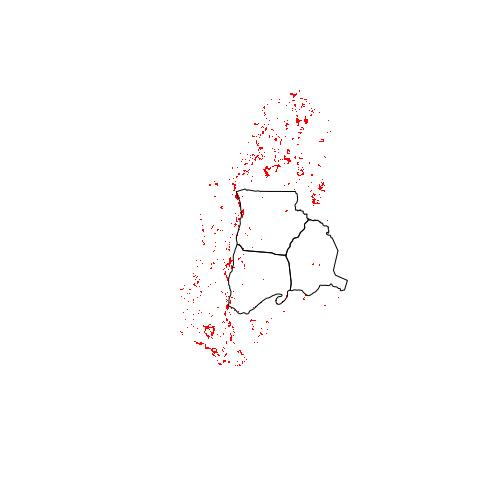

Datos Habitats
================
Marius Bottin
2023-04-19

- [1 Habitats acuaticos](#1-habitats-acuaticos)
  - [1.1 Datos generales:](#11-datos-generales)
  - [1.2 En que nivel se definen la variables de habitat
    acuatico](#12-en-que-nivel-se-definen-la-variables-de-habitat-acuatico)
    - [1.2.1 Habitat lentico/lotico](#121-habitat-lenticolotico)
    - [1.2.2 Clasificación cuerpo de
      agua](#122-clasificación-cuerpo-de-agua)
    - [1.2.3 Orden Red hídrica](#123-orden-red-hídrica)
- [2 Integrando los habitats
  acúaticos](#2-integrando-los-habitats-acúaticos)
  - [2.1 Lentico Lotico](#21-lentico-lotico)
  - [2.2 Tipo de cuerpo de agua](#22-tipo-de-cuerpo-de-agua)
- [3 Integrating landcovers](#3-integrating-landcovers)
- [4 Asignar las coberturas homologadas de
  aves](#4-asignar-las-coberturas-homologadas-de-aves)
- [5 Diferencia entre ANH de la base de datos y ANH de la lista
  homologada](#5-diferencia-entre-anh-de-la-base-de-datos-y-anh-de-la-lista-homologada)
- [6 Small problems…](#6-small-problems)
- [7 Coberturas y ANH](#7-coberturas-y-anh)
  - [7.0.1 Convex hulls of ANH](#701-convex-hulls-of-anh)
- [8 cd_gp_event y landcover](#8-cd_gp_event-y-landcover)
  - [8.1 Acuaticos o terrestros](#81-acuaticos-o-terrestros)
  - [8.2 Integrar las coberturas y habitats
    acuaticos](#82-integrar-las-coberturas-y-habitats-acuaticos)
  - [8.3 cobertura a escala del
    evento](#83-cobertura-a-escala-del-evento)
  - [8.4 A escala del grupo de
    eventos](#84-a-escala-del-grupo-de-eventos)
  - [8.5 Numbers](#85-numbers)
- [9 Problema: puntos fuera de las zonas de
  plataformas](#9-problema-puntos-fuera-de-las-zonas-de-plataformas)

------------------------------------------------------------------------

En este documento, se trata de añadir las coberturas y los datos de
habitat acuatico, así como de analisar los datos espaciales a nivel de
los puntos de referencia (“ANH”), cuando sea posible…

``` r
require(openxlsx)
```

    ## Loading required package: openxlsx

``` r
require(RPostgreSQL)
```

    ## Loading required package: RPostgreSQL

    ## Loading required package: DBI

``` r
fracking_db <- dbConnect(PostgreSQL(),dbname='fracking')
knitr::opts_chunk$set(tidy.opts = list(width.cutoff = 70), tidy = TRUE, connection="fracking_db", max.print=100, fig.path="./Fig/habitat_")
def.chunk.hook  <- knitr::knit_hooks$get("chunk")
knitr::knit_hooks$set(chunk = function(x, options) {
  x <- def.chunk.hook(x, options)
  paste0("\n \\", "footnotesize","\n\n", x, "\n\n \\normalsize\n\n")
})
```

# 1 Habitats acuaticos

## 1.1 Datos generales:

**PECES**

``` sql
SELECT habitat, water_body, REGEXP_REPLACE(water_body,'^([A-Z]\w+\M)(.*)','\1'), REGEXP_REPLACE(water_body,'^([A-Z]\w+\M)(.*)','\2'), count(*)
FROM raw_dwc.peces_event
GROUP BY habitat, water_body
```

<div class="knitsql-table">

| habitat | water_body             | regexp_replace | regexp_replace  | count |
|:--------|:-----------------------|:---------------|:----------------|------:|
| Léntico | Ciénaga Yarirí         | Ciénaga        | Yarirí          |     5 |
| Lótico  | Caño Negro             | Caño           | Negro           |    40 |
| Léntico | Caño El Salado         | Caño           | El Salado       |     4 |
| Lótico  | Río Magdalena          | Río            | Magdalena       |    30 |
| Lótico  | Quebrada La Arenosa    | Quebrada       | La Arenosa      |    16 |
| Lótico  | Quebrada La Morena     | Quebrada       | La Morena       |    19 |
| Lótico  | Caño La Gómez          | Caño           | La Gómez        |     6 |
| Léntico | Ciénaga de Corredor    | Ciénaga        | de Corredor     |     3 |
| Léntico | Ciénaga Corredor       | Ciénaga        | Corredor        |     3 |
| Lótico  | Quebrada el Trece      | Quebrada       | el Trece        |    14 |
| Lótico  | Caño El Salado         | Caño           | El Salado       |    19 |
| Lótico  | Quebrada la Arenosa    | Quebrada       | la Arenosa      |     2 |
| Lótico  | Quebrada Agua Bonita   | Quebrada       | Agua Bonita     |    10 |
| Léntico | Ciénaga Aguas Negras   | Ciénaga        | Aguas Negras    |     4 |
| Lótico  | Quebrada Sogamosito    | Quebrada       | Sogamosito      |     6 |
| Léntico | Ciénaga de Montecristo | Ciénaga        | de Montecristo  |     6 |
| Lótico  | Quebrada La Cristalina | Quebrada       | La Cristalina   |     6 |
| Léntico | Ciénaga El Salado      | Ciénaga        | El Salado       |     6 |
| Lótico  | Caño Corredor          | Caño           | Corredor        |    29 |
| Lótico  | Caño Angustias         | Caño           | Angustias       |     7 |
| Léntico | Poza de los Caimanes   | Poza           | de los Caimanes |     6 |
| Lótico  | Quebrada Corredor      | Quebrada       | Corredor        |    11 |
| Lótico  | Quebrada San Martin    | Quebrada       | San Martin      |    12 |
| Lótico  | Quebarda San Martin    | Quebarda       | San Martin      |     7 |
| Lótico  | Caño La Gómez          | Caño           | La Gómez        |     7 |
| Léntico | Ciénaga de Paredes     | Ciénaga        | de Paredes      |     5 |
| Léntico | Cienaga de Paredes     | Cienaga        | de Paredes      |     6 |

27 records

</div>

**OTROS**

``` sql
SELECT habitat, water_body, clasificación_cuerpo_de_agua, count(*) 
FROM raw_dwc.hidrobiologico_event
GROUP BY habitat, water_body, clasificación_cuerpo_de_agua
```

<div class="knitsql-table">

| habitat | water_body           | clasificación_cuerpo_de_agua | count |
|:--------|:---------------------|:-----------------------------|------:|
| Léntico | Aguas Negras         | Cíenaga                      |    23 |
| Lótico  | Los Chorroros        | Quebrada                     |    52 |
| Lótico  | Angustias            | Caño                         |    26 |
| Léntico | Paredes              | Cíenaga                      |    26 |
| Lótico  | Negro/Dantas         | Caño                         |    52 |
| Lótico  | La 13                | Quebrada                     |    26 |
| Lótico  | La Gomez             | Caño                         |    26 |
| Léntico | EL Salado            | Cíenaga                      |    26 |
| Lótico  | San Martín           | Quebrada                     |    52 |
| Léntico | Monte Cristo         | Cíenaga                      |    26 |
| Lótico  | Negro                | Caño                         |   101 |
| Léntico | Corredor             | Cíenaga                      |    26 |
| Lótico  | Magdalena            | Río                          |   124 |
| Léntico | Yariri               | Cíenaga                      |    26 |
| Lótico  | Corredor             | Quebrada                     |    52 |
| Lótico  | Corredor             | Caño                         |    78 |
| Lótico  | Raicero              | Caño                         |    26 |
| Lótico  | EL Salado            | Caño                         |    78 |
| Lótico  | La Arenosa           | Quebrada                     |    78 |
| Léntico | Poza de los Caimanes | Cíenaga                      |    26 |
| Lótico  | La Morena            | Quebrada                     |    52 |
| Lótico  | Agua Bonita          | Quebrada                     |    52 |

22 records

</div>

**Orden Red hídrica**

``` sql
SELECT measurement_value__orden__ , count(*)
FROM raw_dwc.peces_event
GROUP BY measurement_value__orden__
ORDER BY measurement_value__orden__
```

<div class="knitsql-table">

| measurement_value\_\_orden\_\_ | count |
|-------------------------------:|------:|
|                              0 |    56 |
|                              1 |    72 |
|                              2 |    82 |
|                              3 |    23 |
|                              4 |    26 |
|                              6 |    30 |

6 records

</div>

**Note: Existen las Cíenaga El Salado y el caño El Salado, averiguar que
no sea un error**

**Note: no existe el dato de orden de red hidrica en los hidrobiologicos
otros que peces?**

## 1.2 En que nivel se definen la variables de habitat acuatico

### 1.2.1 Habitat lentico/lotico

``` sql
WITH a AS(
(
SELECT habitat, cd_event, cd_gp_event, cd_pt_ref
FROM raw_dwc.peces_event
)
UNION ALL
(
SELECT habitat, cd_event, cd_gp_event, cd_pt_ref
FROM raw_dwc.hidrobiologico_event
)
)
SELECT cd_pt_ref,ARRAY_AGG(DISTINCT habitat) habitats, count(*)
FROM a
GROUP BY cd_pt_ref
HAVING ARRAY_LENGTH(ARRAY_AGG(DISTINCT habitat),1)>1
```

<div class="knitsql-table">

| cd_pt_ref | habitats         | count |
|----------:|:-----------------|------:|
|       342 | {Léntico,Lótico} |    31 |

1 records

</div>

Un solo cd_pt_ref corresponde a 2 habitats diferentes (probablemente se
trata de un error).

``` sql
WITH a AS(
(
SELECT habitat, cd_event, cd_gp_event, cd_pt_ref
FROM raw_dwc.peces_event
)
UNION ALL
(
SELECT habitat, cd_event, cd_gp_event, cd_pt_ref
FROM raw_dwc.peces_event
)
)
SELECT name_pt_ref, a.habitat, ge.cd_gp_biol, ge.campaign_nb, protocol_spa
FROM a
LEFT JOIN main.punto_referencia USING (cd_pt_ref)
LEFT JOIN main.gp_event ge USING (cd_gp_event)
LEFT JOIN main.def_protocol USING (cd_protocol)
WHERE a.cd_pt_ref=341
```

<div class="knitsql-table">

| name_pt_ref | habitat | cd_gp_biol | campaign_nb | protocol_spa |
|:------------|:--------|:-----------|------------:|:-------------|
| ANH_37      | Lótico  | pece       |           1 | Atarraya     |
| ANH_37      | Lótico  | pece       |           1 | Atarraya     |
| ANH_37      | Lótico  | pece       |           1 | Atarraya     |
| ANH_37      | Lótico  | pece       |           1 | Atarraya     |
| ANH_37      | Lótico  | pece       |           1 | Arrastre     |
| ANH_37      | Lótico  | pece       |           1 | Arrastre     |
| ANH_37      | Lótico  | pece       |           1 | Arrastre     |
| ANH_37      | Lótico  | pece       |           1 | Arrastre     |
| ANH_37      | Lótico  | pece       |           1 | Electropesca |
| ANH_37      | Lótico  | pece       |           1 | Electropesca |
| ANH_37      | Lótico  | pece       |           1 | Trasmallo    |
| ANH_37      | Lótico  | pece       |           1 | Trasmallo    |
| ANH_37      | Lótico  | pece       |           1 | Trasmallo    |
| ANH_37      | Lótico  | pece       |           1 | Trasmallo    |
| ANH_37      | Lótico  | pece       |           2 | Atarraya     |
| ANH_37      | Lótico  | pece       |           2 | Atarraya     |
| ANH_37      | Lótico  | pece       |           2 | Atarraya     |
| ANH_37      | Lótico  | pece       |           2 | Atarraya     |
| ANH_37      | Lótico  | pece       |           2 | Arrastre     |
| ANH_37      | Lótico  | pece       |           2 | Arrastre     |
| ANH_37      | Lótico  | pece       |           2 | Arrastre     |
| ANH_37      | Lótico  | pece       |           2 | Arrastre     |
| ANH_37      | Lótico  | pece       |           2 | Electropesca |
| ANH_37      | Lótico  | pece       |           2 | Electropesca |
| ANH_37      | Lótico  | pece       |           2 | Electropesca |
| ANH_37      | Lótico  | pece       |           2 | Electropesca |

26 records

</div>

**Parece que lo que pasó es que este ANH, en peces ha sido considerado
léntico en la primera temporada de muestreo y lótico en la segunda
campaña de muestreo.**

### 1.2.2 Clasificación cuerpo de agua

``` sql
WITH a AS(
(
SELECT REGEXP_REPLACE(water_body,'^([A-Z]\w+\M)(.*)','\1') clas_cuer_agua, cd_event, cd_gp_event, cd_pt_ref
FROM raw_dwc.peces_event
)
UNION ALL
(
SELECT clasificación_cuerpo_de_agua, cd_event, cd_gp_event, cd_pt_ref
FROM raw_dwc.hidrobiologico_event
)
)
SELECT cd_pt_ref, ARRAY_AGG(DISTINCT clas_cuer_agua)
FROM a
GROUP BY cd_pt_ref
HAVING ARRAY_LENGTH(ARRAY_AGG(DISTINCT clas_cuer_agua),1)>1
```

<div class="knitsql-table">

| cd_pt_ref | array_agg                 |
|----------:|:--------------------------|
|       315 | {Cienaga,Ciénaga,Cíenaga} |
|       322 | {Quebarda,Quebrada}       |
|       323 | {Quebarda,Quebrada}       |
|       324 | {Ciénaga,Cíenaga}         |
|       325 | {Cíenaga,Poza}            |
|       339 | {Ciénaga,Cíenaga}         |
|       352 | {Ciénaga,Cíenaga}         |
|       357 | {Ciénaga,Cíenaga}         |
|       358 | {Ciénaga,Cíenaga}         |

9 records

</div>

Parece que la mayoría de las diferencias son errores ortograficos…
Excepto en lo que concierne los puntos 324, 342, 345, 346

``` sql
WITH a AS(
(
SELECT REGEXP_REPLACE(water_body,'^([A-Z]\w+\M)(.*)','\1') clas_cuer_agua, cd_event, cd_gp_event, cd_pt_ref
FROM raw_dwc.peces_event
)
UNION ALL
(
SELECT clasificación_cuerpo_de_agua, cd_event, cd_gp_event, cd_pt_ref
FROM raw_dwc.hidrobiologico_event
)
)
SELECT name_pt_ref, a.clas_cuer_agua, ARRAY_AGG(DISTINCT ge.cd_gp_biol) gps_biol, ARRAY_AGG(DISTINCT ge.campaign_nb) campaigns, ARRAY_AGG(DISTINCT protocol_spa) protocols
FROM a
LEFT JOIN main.punto_referencia USING (cd_pt_ref)
LEFT JOIN main.gp_event ge USING (cd_gp_event)
LEFT JOIN main.def_protocol USING (cd_protocol)
WHERE a.cd_pt_ref IN (324, 342, 345, 346)
GROUP BY name_pt_ref, a.clas_cuer_agua,num_anh 
ORDER BY num_anh
```

<div class="knitsql-table">

| name_pt_ref | clas_cuer_agua | gps_biol                        | campaigns | protocols                                                                                                               |
|:------------|:---------------|:--------------------------------|:----------|:------------------------------------------------------------------------------------------------------------------------|
| ANH_9       | Ciénaga        | {pece}                          | {1,2}     | {Atarraya,Trasmallo}                                                                                                    |
| ANH_9       | Cíenaga        | {fipl,mafi,minv,peri,zopl}      | {1,2}     | {“Botella Van Dorn”,Cuadrantes,Raspados,“Red tipo D asociados con macrofitas”}                                          |
| ANH_38      | Caño           | {fipl,mafi,minv,pece,peri,zopl} | {1,2}     | {Arrastre,Atarraya,“Botella Van Dorn”,Cuadrantes,Electropesca,Raspados,“Red tipo D asociados con macrofitas”,Trasmallo} |
| ANH_41      | Quebrada       | {fipl,mafi,minv,pece,peri,zopl} | {1,2}     | {Arrastre,Atarraya,“Botella Van Dorn”,Cuadrantes,Electropesca,Kick,Raspados}                                            |
| ANH_42      | Caño           | {fipl,mafi,minv,pece,peri,zopl} | {1,2}     | {Arrastre,Atarraya,“Botella Van Dorn”,Cuadrantes,Electropesca,Kick,Raspados,Trasmallo}                                  |

5 records

</div>

Parece que la definición del tipo de cuerpo de agua depende de si
concierne peces o otros organismos acuáticos…

Antes de poder tratar eso, **necesito saber si debemos unificar entre
grupos biologicos, o sí los consideramos a la escala de los grupos
biologicos**

### 1.2.3 Orden Red hídrica

``` sql
SELECT pe.cd_pt_ref, ARRAY_AGG(DISTINCT measurement_value__orden__)
FROM raw_dwc.peces_event pe
LEFT JOIN main.punto_referencia USING (cd_pt_ref)
LEFT JOIN main.gp_event ge USING (cd_gp_event)
GROUP BY pe.cd_pt_ref
--HAVING ARRAY_LENGTH(ARRAY_AGG(DISTINCT measurement_value__orden__),1) > 1 
```

<div class="knitsql-table">

| cd_pt_ref | array_agg |
|----------:|:----------|
|       315 | {0}       |
|       322 | {1}       |
|       323 | {1}       |
|       324 | {0}       |
|       325 | {0}       |
|       326 | {0}       |
|       327 | {1}       |
|       328 | {1}       |
|       329 | {1}       |
|       330 | {0}       |
|       331 | {3}       |
|       332 | {1}       |
|       333 | {2}       |
|       334 | {6}       |
|       335 | {6}       |
|       336 | {6}       |
|       337 | {6}       |
|       338 | {6}       |
|       339 | {0}       |
|       340 | {1}       |
|       341 | {1}       |
|       342 | {1}       |
|       343 | {2}       |
|       344 | {2}       |
|       345 | {2}       |
|       346 | {2}       |
|       347 | {2}       |
|       348 | {1}       |
|       349 | {2}       |
|       350 | {3}       |
|       351 | {4}       |
|       352 | {0}       |
|       353 | {3}       |
|       354 | {2}       |
|       355 | {2}       |
|       357 | {0}       |
|       358 | {0}       |
|       359 | {2}       |
|       360 | {2}       |
|       361 | {4}       |
|       362 | {4}       |

41 records

</div>

Parece que los ordenes de red hidrica, sí son definidos a la escala de
la ANH, sin excepción

# 2 Integrando los habitats acúaticos

## 2.1 Lentico Lotico

Creación de la variable:

``` sql
INSERT INTO main.def_var_habitat(var_habitat,type_var,var_habitat_spa,var_habitat_comment)
VALUES('Freshwater ecosystem type',
   'categorial',
   'Tipo de ecosistema acuático',
   NULL
)
RETURNING cd_var_habitat,var_habitat,var_habitat_spa;
```

Creación de las categorías

``` sql
INSERT INTO main.def_categ_habitat(categ,cd_var_habitat,categ_spa)
VALUES
  (
   'Lentic',
   (SELECT cd_var_habitat FROM main.def_var_habitat WHERE var_habitat='Freshwater ecosystem type'),
   'Léntico'
  ),
  (
   'Lotic',
   (SELECT cd_var_habitat FROM main.def_var_habitat WHERE var_habitat='Freshwater ecosystem type'),
   'Lótico'
  )
RETURNING cd_categ, categ, categ_spa;
```

Atribución de los habitat a los ANH:

``` sql
INSERT INTO main.habitat(cd_pt_ref,cd_var_habitat,cd_categ)
WITH a AS(
(
SELECT habitat, cd_event, cd_gp_event, cd_pt_ref
FROM raw_dwc.peces_event
)
UNION ALL
(
SELECT habitat, cd_event, cd_gp_event, cd_pt_ref
FROM raw_dwc.hidrobiologico_event
)
)
SELECT DISTINCT ON (cd_pt_ref) cd_pt_ref,(SELECT cd_var_habitat FROM main.def_var_habitat WHERE var_habitat='Freshwater ecosystem type'),cd_categ--,count(*)
FROM a
LEFT JOIN main.def_categ_habitat ON habitat=categ_spa AND cd_var_habitat=(SELECT cd_var_habitat FROM main.def_var_habitat WHERE var_habitat='Freshwater ecosystem type')
GROUP BY cd_pt_ref,cd_categ
ORDER BY cd_pt_ref,count(*) DESC
RETURNING cd_habitat,cd_pt_ref,cd_categ
```

## 2.2 Tipo de cuerpo de agua

Creación de la variable:

``` sql
INSERT INTO main.def_var_habitat(var_habitat,type_var,var_habitat_spa,var_habitat_comment)
VALUES('Waterbody type',
   'categorial',
   'Tipo de cuerpo de agua',
   NULL
)
RETURNING cd_var_habitat,var_habitat,var_habitat_spa;
```

Creación de las categorías

``` sql
INSERT INTO main.def_categ_habitat(categ,cd_var_habitat,categ_spa)
VALUES
  (
   'River',
   (SELECT cd_var_habitat FROM main.def_var_habitat WHERE var_habitat='Waterbody type'),
   'Río'
  ),
  (
   'Stream',
   (SELECT cd_var_habitat FROM main.def_var_habitat WHERE var_habitat='Waterbody type'),
   'Quebrada'
  ),
  (
   'Swamp',
   (SELECT cd_var_habitat FROM main.def_var_habitat WHERE var_habitat='Waterbody type'),
   'Ciénaga'
  ),
  (
   'Creek',
   (SELECT cd_var_habitat FROM main.def_var_habitat WHERE var_habitat='Waterbody type'),
   'Caño'
  )
RETURNING cd_categ, categ, categ_spa;
```

Atribución de los habitat a los ANH:

``` sql
INSERT INTO main.habitat(cd_pt_ref,cd_var_habitat,cd_categ)
WITH a AS(
(
SELECT REGEXP_REPLACE(water_body,'^([A-Z]\w+\M)(.*)','\1') clas_cuer_agua, cd_event, cd_gp_event, cd_pt_ref
FROM raw_dwc.peces_event
)
UNION ALL
(
SELECT clasificación_cuerpo_de_agua, cd_event, cd_gp_event, cd_pt_ref
FROM raw_dwc.hidrobiologico_event
)
),b AS(
SELECT /*DISTINCT ON (cd_pt_ref)*/ a.cd_pt_ref, cd_gp_biol, CASE WHEN cd_gp_biol = 'pece' THEN 0 ELSE 1 END priority_gp_biol,
  CASE
    WHEN clas_cuer_agua ~ '^C[íi][eé]naga$' THEN 'Swamp'
    WHEN clas_cuer_agua ~ 'R[íi]o' THEN 'River'
    WHEN clas_cuer_agua ~ '^Que' THEN 'Stream'
    WHEN clas_cuer_agua ~ 'Ca[ñn]o' THEN 'Creek'
    WHEN clas_cuer_agua='Poza' THEN 'Swamp'
  END categ
    
    --,count(*)
FROM a
LEFT JOIN main.gp_event USING (cd_gp_event)
)
SELECT DISTINCT ON (cd_pt_ref) cd_pt_ref,(SELECT cd_var_habitat FROM main.def_var_habitat WHERE var_habitat='Waterbody type'), cd_categ
FROM b
LEFT JOIN main.def_categ_habitat dch ON b.categ=dch.categ AND cd_var_habitat=(SELECT cd_var_habitat FROM main.def_var_habitat WHERE var_habitat='Waterbody type')
GROUP BY cd_pt_ref,priority_gp_biol,cd_categ
ORDER BY cd_pt_ref,priority_gp_biol
RETURNING cd_habitat,cd_pt_ref,cd_categ
```

# 3 Integrating landcovers

``` r
wb <- loadWorkbook("../../bpw_data_repo/habitat/Coberturas_MB.xlsx")
cob_def <- read.xlsx(wb, sheet = "N3 Cobertura")
hab_def <- read.xlsx(wb, sheet = "Cob Homologada")
colnames(hab_def) <- gsub("[().-]", "_", tolower(gsub("([a-z])([A-Z]+)",
    "\\1_\\L\\2", colnames(hab_def), perl = T)))
unique(cob_def[2:3])
```

    ##              Cobertura       landcover
    ## 1               Urbano           Urban
    ## 4                 Vias            Road
    ## 6             Cultivos            Crop
    ## 8                Palma Palm plantation
    ## 9               Pastos         Pasture
    ## 14        Bosque Denso    Dense forest
    ## 15      Bosque Abierto     Open forest
    ## 16      Bosque Ripario Riparian forest
    ## 17 Plantacion Forestal Wood plantation
    ## 18          Herbazales       Grassland
    ## 21               Otros           Other
    ## 24    Zonas Pantanosas       Marshland
    ## 26        Cuerpos Agua       Waterbody

``` r
dbWriteTable(fracking_db, name = c("raw_geom", "cob_def"), value = cob_def,
    overwrite = T)
```

    ## [1] TRUE

``` r
dbWriteTable(fracking_db, name = c("raw_geom", "homolog_def"), value = hab_def,
    overwrite = T)
```

    ## [1] TRUE

``` sql
INSERT INTO spat.def_landcov(landcov_spa, landcov)
SELECT DISTINCT "Cobertura", landcover
FROM raw_geom.cob_def
RETURNING cd_landcov, landcov, landcov_spa
```

``` sql
SELECT "Cobertura",count(*)
FROM raw_geom.cobertura rc
LEFT JOIN raw_geom.cob_def rcd ON rc.n3_cobert=rcd."N3_COBERT"
LEFT JOIN spat.def_landcov sdl ON rcd."Cobertura"=sdl.landcov_spa
GROUP BY "Cobertura"
```

<div class="knitsql-table">

| Cobertura           | count |
|:--------------------|------:|
| NA                  |    67 |
| Bosque Abierto      |    49 |
| Vias                |   102 |
| Plantacion Forestal |     9 |
| Herbazales          |  3287 |
| Bosque Ripario      |   562 |
| Palma               |  1024 |
| Cuerpos Agua        |   670 |
| Pastos              |  2429 |
| Cultivos            |   116 |
| Otros               |   765 |
| Urbano              |   223 |
| Bosque Denso        |   241 |
| Zonas Pantanosas    |   840 |

14 records

</div>

``` sql
INSERT INTO spat.landcov(cd_landcov,the_geom)
SELECT sdl.cd_landcov, ST_transform((ST_Dump(wkb_geometry)).geom,(SELECT proj4text FROM spatial_ref_sys WHERE srid=3116)) the_geom
FROM raw_geom.cobertura rc
LEFT JOIN raw_geom.cob_def rcd ON rc.n3_cobert=rcd."N3_COBERT"
LEFT JOIN spat.def_landcov sdl ON rcd."Cobertura"=sdl.landcov_spa
RETURNING gid,cd_landcov
```

Corregir los habitats homologados:

``` sql
SELECT DISTINCT cobert_xhabitat_aves,
  CASE
   WHEN cobert_xhabitat_aves IN ('Pastos limpios','Pastos enmalezados') THEN 'Pastos'
   WHEN cobert_xhabitat_aves = 'Pastos arbolados' THEN 'Pastos'
   WHEN cobert_xhabitat_aves = 'Ciénaga' THEN 'Cuerpos Agua'
   WHEN cobert_xhabitat_aves = 'Herbazal' THEN 'Herbazales'
   WHEN cobert_xhabitat_aves = 'Bosque denso' THEN 'Bosque Denso'
   WHEN cobert_xhabitat_aves = 'Bosque abierto' THEN 'Bosque Abierto'
   WHEN cobert_xhabitat_aves = 'Vías' THEN 'Vias'
   ELSE cobert_xhabitat_aves
  END landcov_spa
FROM raw_geom.homolog_def
ORDER BY landcov_spa, cobert_xhabitat_aves
```

<div class="knitsql-table">

| cobert_xhabitat_aves | landcov_spa    |
|:---------------------|:---------------|
| Bosque abierto       | Bosque Abierto |
| Bosque Abierto       | Bosque Abierto |
| Bosque denso         | Bosque Denso   |
| Bosque Denso         | Bosque Denso   |
| Bosque Ripario       | Bosque Ripario |
| Ciénaga              | Cuerpos Agua   |
| Herbazal             | Herbazales     |
| Herbazales           | Herbazales     |
| Palma                | Palma          |
| Pastos               | Pastos         |
| Pastos arbolados     | Pastos         |
| Pastos enmalezados   | Pastos         |
| Pastos limpios       | Pastos         |
| Vias                 | Vias           |
| Vías                 | Vias           |

15 records

</div>

``` sql
ALTER TABLE raw_geom.homolog_def ADD COLUMN landcov_spa varchar(50) REFERENCES spat.def_landcov(landcov_spa);
UPDATE raw_geom.homolog_def
SET landcov_spa=
  CASE
   WHEN cobert_xhabitat_aves IN ('Pastos limpios','Pastos enmalezados') THEN 'Pastos'
   WHEN cobert_xhabitat_aves = 'Pastos arbolados' THEN 'Pastos'
   WHEN cobert_xhabitat_aves = 'Ciénaga' THEN 'Cuerpos Agua'
   WHEN cobert_xhabitat_aves = 'Herbazal' THEN 'Herbazales'
   WHEN cobert_xhabitat_aves = 'Bosque denso' THEN 'Bosque Denso'
   WHEN cobert_xhabitat_aves = 'Bosque abierto' THEN 'Bosque Abierto'
   WHEN cobert_xhabitat_aves = 'Vías' THEN 'Vias'
   ELSE cobert_xhabitat_aves
  END
RETURNING cobert_xhabitat_aves,landcov_spa
;
```

<div class="knitsql-table">

| cobert_xhabitat_aves | landcov_spa    |
|:---------------------|:---------------|
| Pastos               | Pastos         |
| Pastos               | Pastos         |
| Bosque Ripario       | Bosque Ripario |
| Ciénaga              | Cuerpos Agua   |
| Bosque Abierto       | Bosque Abierto |
| Pastos               | Pastos         |
| Bosque Denso         | Bosque Denso   |
| Bosque Abierto       | Bosque Abierto |
| Bosque Abierto       | Bosque Abierto |
| Bosque Abierto       | Bosque Abierto |
| Palma                | Palma          |
| Palma                | Palma          |
| Palma                | Palma          |
| Palma                | Palma          |
| Palma                | Palma          |
| Palma                | Palma          |
| Palma                | Palma          |
| Palma                | Palma          |
| Palma                | Palma          |
| Palma                | Palma          |
| Palma                | Palma          |
| Bosque Ripario       | Bosque Ripario |
| Bosque Ripario       | Bosque Ripario |
| Bosque Ripario       | Bosque Ripario |
| Bosque Ripario       | Bosque Ripario |
| Bosque Ripario       | Bosque Ripario |
| Bosque Ripario       | Bosque Ripario |
| Bosque Ripario       | Bosque Ripario |
| Bosque Ripario       | Bosque Ripario |
| Bosque Ripario       | Bosque Ripario |
| Bosque Ripario       | Bosque Ripario |
| Bosque Ripario       | Bosque Ripario |
| Bosque Ripario       | Bosque Ripario |
| Bosque Ripario       | Bosque Ripario |
| Bosque Ripario       | Bosque Ripario |
| Bosque denso         | Bosque Denso   |
| Bosque Ripario       | Bosque Ripario |
| Palma                | Palma          |
| Palma                | Palma          |
| Palma                | Palma          |
| Pastos               | Pastos         |
| Bosque Ripario       | Bosque Ripario |
| Bosque Ripario       | Bosque Ripario |
| Herbazal             | Herbazales     |
| Herbazal             | Herbazales     |
| Herbazal             | Herbazales     |
| Palma                | Palma          |
| Herbazal             | Herbazales     |
| Bosque Ripario       | Bosque Ripario |
| Bosque Ripario       | Bosque Ripario |
| Bosque Ripario       | Bosque Ripario |
| Bosque Ripario       | Bosque Ripario |
| Bosque Ripario       | Bosque Ripario |
| Bosque Ripario       | Bosque Ripario |
| Bosque Ripario       | Bosque Ripario |
| Bosque Ripario       | Bosque Ripario |
| Bosque Ripario       | Bosque Ripario |
| Ciénaga              | Cuerpos Agua   |
| Bosque Ripario       | Bosque Ripario |
| Bosque Ripario       | Bosque Ripario |
| Palma                | Palma          |
| Palma                | Palma          |
| Bosque Ripario       | Bosque Ripario |
| Herbazal             | Herbazales     |
| Bosque Ripario       | Bosque Ripario |
| Bosque Ripario       | Bosque Ripario |
| Bosque Ripario       | Bosque Ripario |
| Bosque Ripario       | Bosque Ripario |
| Bosque Ripario       | Bosque Ripario |
| Bosque Ripario       | Bosque Ripario |
| Bosque Ripario       | Bosque Ripario |
| Bosque Ripario       | Bosque Ripario |
| Bosque Ripario       | Bosque Ripario |
| Bosque Ripario       | Bosque Ripario |
| Herbazales           | Herbazales     |
| Pastos enmalezados   | Pastos         |
| Herbazales           | Herbazales     |
| Pastos arbolados     | Pastos         |
| Herbazales           | Herbazales     |
| Bosque Abierto       | Bosque Abierto |
| Bosque Denso         | Bosque Denso   |
| Pastos limpios       | Pastos         |
| Bosque Abierto       | Bosque Abierto |
| Bosque Ripario       | Bosque Ripario |
| Bosque Ripario       | Bosque Ripario |
| Bosque Ripario       | Bosque Ripario |
| Bosque Ripario       | Bosque Ripario |
| Bosque Ripario       | Bosque Ripario |
| Bosque Ripario       | Bosque Ripario |
| Bosque Ripario       | Bosque Ripario |
| Bosque Ripario       | Bosque Ripario |
| Bosque Ripario       | Bosque Ripario |
| Herbazales           | Herbazales     |
| Herbazales           | Herbazales     |
| Pastos limpios       | Pastos         |
| Bosque Ripario       | Bosque Ripario |
| Bosque Ripario       | Bosque Ripario |
| Bosque Ripario       | Bosque Ripario |
| Bosque Ripario       | Bosque Ripario |
| Bosque Ripario       | Bosque Ripario |

Displaying records 1 - 100

</div>

# 4 Asignar las coberturas homologadas de aves

**NOTA: metodología cambiada, lo guardamos acá solo por información!**

``` sql
SELECT grupo_biolo,count(*)
FROM raw_geom.homolog_def
GROUP BY grupo_biolo
```

<div class="knitsql-table">

| grupo_biolo | count |
|:------------|------:|
| Cualquiera  |     1 |
| Herpetos    |    42 |
| Mariposas   |    40 |
| Mamiferos   |    32 |
| Escarabajos |    40 |
| Hormigas    |    40 |
| Aves        |    65 |
| Collembolos |    40 |

8 records

</div>

Elegir la cobertura de la primera temporada de muestreo cuando la
cobertura cambio entre las temporadas:

``` sql
SELECT *
FROM raw_geom.homolog_def
WHERE grupo_biolo='Aves'
  AND parent_even !~ 'ANH_[0-9]{1,3}$'
```

<div class="knitsql-table">

| row.names | parent_even | grupo_biolo | cobert_xhabitat_aves | landcov_spa |
|:----------|:------------|:------------|:---------------------|:------------|
| 46        | ANH_282 T1  | Aves        | Herbazal             | Herbazales  |
| 47        | ANH_282 T2  | Aves        | Palma                | Palma       |

2 records

</div>

``` sql
UPDATE raw_geom.homolog_def
SET parent_even='ANH_282'
WHERE parent_even='ANH_282 T1'
RETURNING "row.names", parent_even
```

``` sql
DELETE FROM raw_geom.homolog_def
WHERE parent_even='ANH_282 T2'
RETURNING "row.names"
```

# 5 Diferencia entre ANH de la base de datos y ANH de la lista homologada

``` sql
SELECT a.name_pt_ref,hd.parent_even
FROM (SELECT parent_even FROM raw_geom.homolog_def WHERE grupo_biolo='Aves') hd
FULL OUTER JOIN 
 (SELECT DISTINCT cd_gp_biol,name_pt_ref FROM main.gp_event LEFT JOIN main.punto_referencia USING (cd_pt_ref) WHERE cd_gp_biol='aves' AND name_pt_ref IS NOT NULL) a 
   ON a.name_pt_ref=hd.parent_even
WHERE a.name_pt_ref IS NULL OR hd.parent_even IS NULL
```

<div class="knitsql-table">

| name_pt_ref | parent_even |
|:------------|:------------|
| ANH_380     | NA          |
| ANH_404     | NA          |
| ANH_92      | NA          |
| NA          | ANH_375     |

4 records

</div>

**Faltan 3 ANH en el archivo de Francisco que tienen ANH para Aves en la
base de datos**

# 6 Small problems…

Homologadas

``` sql
SELECT parent_even, ARRAY_AGG(grupo_biolo), ARRAY_AGG(cobert_xhabitat_aves)
FROM raw_geom.homolog_def
GROUP BY parent_even
HAVING ARRAY_LENGTH(ARRAY_AGG(DISTINCT cobert_xhabitat_aves),1)>1
```

<div class="knitsql-table">

| parent_even | array_agg                                             | array_agg                                                                        |
|:------------|:------------------------------------------------------|:---------------------------------------------------------------------------------|
| ANH_100     | {Herpetos,Mamiferos}                                  | {Vías,“Bosque Ripario”}                                                          |
| ANH_109     | {Herpetos,Escarabajos,Mariposas,Hormigas,Collembolos} | {Herbazales,“Bosque Ripario”,“Bosque Ripario”,“Bosque Ripario”,“Bosque Ripario”} |
| ANH_120     | {Collembolos,Escarabajos,Mariposas,Hormigas}          | {“Pastos enmalezados”,Herbazales,Herbazales,Pastos}                              |
| ANH_122     | {Escarabajos,Mariposas,Collembolos,Hormigas}          | {Herbazales,Herbazales,“Pastos arbolados”,Pastos}                                |
| ANH_125     | {Hormigas,Collembolos,Escarabajos,Mariposas}          | {“Bosque Ripario”,“Bosque Abierto”,“Bosque Ripario”,“Bosque Ripario”}            |
| ANH_128     | {Hormigas,Aves,Collembolos}                           | {Pastos,Pastos,“Pastos limpios”}                                                 |
| ANH_130     | {Mariposas,Hormigas,Collembolos,Escarabajos}          | {“Bosque abierto”,“Bosque Abierto”,“Bosque Abierto”,“Bosque abierto”}            |
| ANH_135     | {Hormigas,Collembolos,Herpetos,Mariposas,Escarabajos} | {“Bosque Ripario”,“Bosque Ripario”,Herbazales,“Bosque Ripario”,“Bosque Ripario”} |
| ANH_147     | {Escarabajos,Collembolos,Hormigas,Mariposas}          | {Herbazales,“Pastos limpios”,Herbazales,Herbazales}                              |
| ANH_223     | {Herpetos,Aves}                                       | {“Bosque Ripario”,Palma}                                                         |
| ANH_360     | {Herpetos,Aves,Mamiferos}                             | {“Bosque Denso”,“Bosque Ripario”,“Bosque Ripario”}                               |
| ANH_374     | {Mariposas,Hormigas,Collembolos,Herpetos,Escarabajos} | {“Bosque denso”,“Bosque Denso”,“Bosque Denso”,“Bosque Denso”,“Bosque denso”}     |
| ANH_375     | {Herpetos,Collembolos,Aves,Hormigas}                  | {“Bosque Denso”,“Pastos limpios”,Pastos,Pastos}                                  |
| ANH_78      | {Mamiferos,Mamiferos}                                 | {“Bosque Ripario”,“Bosque Denso”}                                                |
| ANH_82      | {Herpetos,Aves}                                       | {“Bosque Ripario”,Herbazal}                                                      |

15 records

</div>

Esas coberturas no están definidas:

``` r
require(rpostgis) & require(sp)
```

    ## Loading required package: rpostgis

    ## Loading required package: sp

    ## [1] TRUE

``` r
zonas <- pgGetGeom(fracking_db, c("main", "platform"), geom = "zona_geom")
```

    ## Returning Polygon types in SpatialPolygons*-class.

``` r
undefined_LC <- pgGetGeom(fracking_db, query = "SELECT gid, the_geom AS geom 
          FROM spat.landcov
          LEFT JOIN spat.def_landcov USING (cd_landcov)
          WHERE landcov IS NULL OR landcov = 'Other'")
```

    ## Returning Polygon types in SpatialPolygons*-class.

``` r
plot(undefined_LC, col = "red", border = NA)
plot(zonas, add = T)
```

<!-- -->

**TODO: decidir lo que hacemos con los poligonos que no tienen cobertura
N3 y que hacer con los poligonos que tienen una cobertura “Otro”.**

# 7 Coberturas y ANH

Los unicos registros que tienen una coordenada geográfica son los
registros de atropellamientos:

``` sql
SELECT cd_gp_biol, count(*)
FROM main.registros r
LEFT JOIN main.event USING (cd_event)
LEFT JOIN main.gp_event USING (cd_gp_event)
WHERE r.the_geom IS NOT NULL
GROUP BY cd_gp_biol
```

<div class="knitsql-table">

| cd_gp_biol | count |
|:-----------|------:|
| atro       |   109 |

1 records

</div>

Los eventos que corresponden a puntos son:

``` sql
SELECT cd_gp_biol, count(*)
FROM main.event e
LEFT JOIN main.gp_event ge USING (cd_gp_event)
WHERE e.pt_geom IS NOT NULL
GROUP BY cd_gp_biol
```

<div class="knitsql-table">

| cd_gp_biol | count |
|:-----------|------:|
| mari       |   477 |
| esca       |   878 |
| mami       |  2063 |
| epnv       |   669 |
| cole       |   960 |
| zopl       |   246 |
| fipl       |   246 |
| mafi       |    82 |
| epva       |     9 |
| catr       |   259 |
| minv       |   246 |
| peri       |   234 |
| pece       |   289 |
| arbo       |   290 |
| aves       |  1052 |
| horm       |  2000 |

16 records

</div>

Los eventos que corresponden a lineas son:

``` sql
SELECT cd_gp_biol, count(*)
FROM main.event e
LEFT JOIN main.gp_event ge USING (cd_gp_event)
WHERE e.li_geom IS NOT NULL
GROUP BY cd_gp_biol
```

<div class="knitsql-table">

| cd_gp_biol | count |
|:-----------|------:|
| herp       |   470 |
| atro       |    50 |

2 records

</div>

``` sql
SELECT name_pt_ref, num_anh, dlpt.landcov_spa, ARRAY_AGG(DISTINCT cd_gp_biol), count(*)
FROM main.event e
LEFT JOIN main.gp_event ge USING (cd_gp_event)
LEFT JOIN main.punto_referencia USING (cd_pt_ref)
LEFT JOIN spat.landcov lpt ON ST_Intersects(e.pt_geom,lpt.the_geom)
LEFT JOIN spat.def_landcov dlpt ON lpt.cd_landcov=dlpt.cd_landcov
LEFT JOIN spat.landcov lli ON ST_Intersects(e.li_geom,lli.the_geom)
LEFT JOIN spat.def_landcov dlli ON lli.cd_landcov=dlli.cd_landcov
WHERE cd_gp_biol NOT IN ('aves','pece','herp','mafi','minv','fipl','zopl','peri','atro')
GROUP BY name_pt_ref, num_anh, dlpt.landcov_spa
ORDER BY num_anh, count(*) DESC
```

<div class="knitsql-table">

| name_pt_ref | num_anh | landcov_spa      | array_agg                  | count |
|:------------|--------:|:-----------------|:---------------------------|------:|
| ANH_12      |      12 | Bosque Ripario   | {arbo,epnv,epva}           |    35 |
| ANH_12      |      12 | Palma            | {catr}                     |     2 |
| ANH_18      |      18 | Bosque Ripario   | {arbo,epnv,epva}           |    35 |
| ANH_31      |      31 | Herbazales       | {catr}                     |     3 |
| ANH_38      |      38 | Pastos           | {catr}                     |     3 |
| ANH_58      |      58 | Bosque Ripario   | {catr}                     |     3 |
| ANH_62      |      62 | Palma            | {catr}                     |     1 |
| ANH_64      |      64 | Palma            | {catr,mami}                |    50 |
| ANH_65      |      65 | Palma            | {catr,mami}                |   112 |
| ANH_66      |      66 | Palma            | {catr,mami}                |    50 |
| ANH_67      |      67 | Palma            | {mami}                     |    40 |
| ANH_68      |      68 | Palma            | {mami}                     |    46 |
| ANH_68      |      68 | Vias             | {mami}                     |     3 |
| ANH_69      |      69 | Palma            | {catr,mami}                |    73 |
| ANH_71      |      71 | Palma            | {mami}                     |    40 |
| ANH_72      |      72 | Bosque Ripario   | {mami}                     |   110 |
| ANH_72      |      72 | Palma            | {mami}                     |     3 |
| ANH_72      |      72 | Cultivos         | {mami}                     |     3 |
| ANH_73      |      73 | Bosque Ripario   | {mami}                     |    44 |
| ANH_73      |      73 | Pastos           | {mami}                     |     3 |
| ANH_74      |      74 | Bosque Ripario   | {mami}                     |   110 |
| ANH_75      |      75 | Bosque Ripario   | {mami}                     |    43 |
| ANH_76      |      76 | Palma            | {mami}                     |    23 |
| ANH_76      |      76 | Bosque Ripario   | {mami}                     |    20 |
| ANH_77      |      77 | Bosque Ripario   | {catr,mami}                |    73 |
| ANH_78      |      78 | Bosque Denso     | {mami}                     |    96 |
| ANH_81      |      81 | Palma            | {catr}                     |     3 |
| ANH_85      |      85 | Herbazales       | {catr}                     |     3 |
| ANH_88      |      88 | Palma            | {mami}                     |    70 |
| ANH_88      |      88 | Bosque Ripario   | {arbo,catr,epnv}           |    40 |
| ANH_89      |      89 | Palma            | {catr,mami}                |   113 |
| ANH_90      |      90 | Palma            | {mami}                     |    46 |
| ANH_91      |      91 | Palma            | {mami}                     |    70 |
| ANH_92      |      92 | Palma            | {mami}                     |   113 |
| ANH_92      |      92 | Vias             | {mami}                     |     5 |
| ANH_93      |      93 | Palma            | {mami}                     |    47 |
| ANH_93      |      93 | Vias             | {mami}                     |     3 |
| ANH_94      |      94 | Bosque Ripario   | {mami}                     |    70 |
| ANH_95      |      95 | Palma            | {catr,mami}                |    71 |
| ANH_96      |      96 | Bosque Ripario   | {mami}                     |   114 |
| ANH_96      |      96 | Palma            | {mami}                     |     3 |
| ANH_97      |      97 | Bosque Ripario   | {mami}                     |    40 |
| ANH_97      |      97 | Zonas Pantanosas | {mami}                     |     3 |
| ANH_97      |      97 | Vias             | {mami}                     |     3 |
| ANH_98      |      98 | Bosque Ripario   | {mami}                     |    43 |
| ANH_99      |      99 | Bosque Ripario   | {mami}                     |    70 |
| ANH_100     |     100 | Bosque Ripario   | {mami}                     |    70 |
| ANH_101     |     101 | Bosque Ripario   | {catr,mami}                |    71 |
| ANH_103     |     103 | Bosque Ripario   | {mami}                     |    43 |
| ANH_103     |     103 | Palma            | {mami}                     |     3 |
| ANH_106     |     106 | Bosque Ripario   | {catr}                     |     3 |
| ANH_108     |     108 | Bosque Ripario   | {cole,esca,horm,mari}      |   107 |
| ANH_108     |     108 | Pastos           | {esca}                     |     1 |
| ANH_109     |     109 | Bosque Ripario   | {cole,esca,horm,mari}      |   108 |
| ANH_109     |     109 | Palma            | {catr}                     |     3 |
| ANH_110     |     110 | Bosque Abierto   | {cole,esca,horm,mari}      |   102 |
| ANH_110     |     110 | Bosque Ripario   | {mari}                     |     6 |
| ANH_112     |     112 | Bosque Ripario   | {catr,cole,esca,horm,mari} |   111 |
| ANH_113     |     113 | Bosque Ripario   | {cole,esca,horm,mari}      |    71 |
| ANH_113     |     113 | Palma            | {cole,horm}                |    37 |
| ANH_114     |     114 | Bosque Ripario   | {cole,esca,horm,mari}      |   108 |
| ANH_115     |     115 | Bosque Ripario   | {cole,esca,horm,mari}      |   108 |
| ANH_116     |     116 | Bosque Ripario   | {cole,esca,horm,mari}      |   105 |
| ANH_117     |     117 | Bosque Ripario   | {cole,esca,horm,mari}      |   108 |
| ANH_118     |     118 | Palma            | {cole,horm}                |    74 |
| ANH_118     |     118 | Herbazales       | {esca,mari}                |    32 |
| ANH_120     |     120 | Otros            | {cole,horm}                |    74 |
| ANH_120     |     120 | Herbazales       | {esca,mari}                |    33 |
| ANH_120     |     120 | Bosque Ripario   | {esca}                     |     1 |
| ANH_121     |     121 | Herbazales       | {catr,cole,esca,horm,mari} |   110 |
| ANH_122     |     122 | Pastos           | {cole,horm}                |    74 |
| ANH_122     |     122 | Herbazales       | {esca,mari}                |    34 |
| ANH_123     |     123 | Herbazales       | {cole,esca,horm,mari}      |   108 |
| ANH_125     |     125 | Bosque Ripario   | {cole,esca,horm,mari}      |    99 |
| ANH_125     |     125 | Herbazales       | {mari}                     |     7 |
| ANH_125     |     125 | Palma            | {esca}                     |     2 |
| ANH_127     |     127 | Bosque Denso     | {cole,horm}                |    74 |
| ANH_130     |     130 | Bosque Abierto   | {cole,esca,horm,mari}      |   108 |
| ANH_130     |     130 | Pastos           | {mami}                     |     2 |
| ANH_131     |     131 | Bosque Ripario   | {cole,esca,horm,mari}      |   108 |
| ANH_132     |     132 | Bosque Ripario   | {cole,esca,horm,mari}      |   108 |
| ANH_133     |     133 | Bosque Ripario   | {cole,esca,horm,mami,mari} |   109 |
| ANH_134     |     134 | Bosque Ripario   | {cole,esca,horm,mari}      |   104 |
| ANH_134     |     134 | Palma            | {esca,horm}                |     4 |
| ANH_135     |     135 | Palma            | {cole,horm}                |    74 |
| ANH_135     |     135 | Bosque Ripario   | {catr,esca,mari}           |    37 |
| ANH_136     |     136 | Bosque Ripario   | {cole,esca,horm,mami,mari} |   111 |
| ANH_136     |     136 | Palma            | {mami}                     |     1 |
| ANH_137     |     137 | Bosque Ripario   | {cole,esca,horm,mari}      |   108 |
| ANH_138     |     138 | Bosque Ripario   | {cole,esca,horm,mari}      |   108 |
| ANH_142     |     142 | Bosque Ripario   | {cole,esca,horm,mari}      |   108 |
| ANH_144     |     144 | Herbazales       | {cole,esca,horm,mari}      |   108 |
| ANH_145     |     145 | Herbazales       | {cole,esca,horm,mari}      |   107 |
| ANH_145     |     145 | Palma            | {catr}                     |     3 |
| ANH_147     |     147 | Herbazales       | {cole,esca,horm,mari}      |   109 |
| ANH_149     |     149 | Bosque Ripario   | {mami}                     |     4 |
| ANH_150     |     150 | Bosque Ripario   | {mami}                     |     3 |
| ANH_153     |     153 | Bosque Ripario   | {mami}                     |     1 |
| ANH_155     |     155 | Palma            | {mami}                     |     1 |
| ANH_158     |     158 | Bosque Ripario   | {mami}                     |     1 |

Displaying records 1 - 100

</div>

### 7.0.1 Convex hulls of ANH

``` sql
CREATE MATERIALIZED VIEW spat.anh_info AS(
WITH a AS(
SELECT cd_pt_ref,name_pt_ref, cd_gp_biol, event_id, num_anh, pt_geom
FROM main.event e
LEFT JOIN main.gp_event ge USING (cd_gp_event)
LEFT JOIN main.punto_referencia USING (cd_pt_ref)
LEFT JOIN spat.landcov lpt ON ST_Intersects(e.pt_geom,lpt.the_geom)
LEFT JOIN spat.def_landcov dlpt ON lpt.cd_landcov=dlpt.cd_landcov
LEFT JOIN spat.landcov lli ON ST_Intersects(e.li_geom,lli.the_geom)
LEFT JOIN spat.def_landcov dlli ON lli.cd_landcov=dlli.cd_landcov
WHERE num_anh IS NOT NULL AND pt_geom IS NOT NULL
/*GROUP BY name_pt_ref, num_anh, dlpt.landcov_spa
ORDER BY num_anh, count(*) DESC
*/
UNION ALL
SELECT cd_pt_ref,name_pt_ref, cd_gp_biol, event_id, num_anh, (ST_DumpPoints(li_geom)).geom
FROM main.event e
LEFT JOIN main.gp_event ge USING (cd_gp_event)
LEFT JOIN main.punto_referencia USING (cd_pt_ref)
LEFT JOIN spat.landcov lpt ON ST_Intersects(e.pt_geom,lpt.the_geom)
LEFT JOIN spat.def_landcov dlpt ON lpt.cd_landcov=dlpt.cd_landcov
LEFT JOIN spat.landcov lli ON ST_Intersects(e.li_geom,lli.the_geom)
LEFT JOIN spat.def_landcov dlli ON lli.cd_landcov=dlli.cd_landcov
WHERE num_anh IS NOT NULL AND li_geom IS NOT NULL
)
SELECT cd_pt_ref, name_pt_ref, num_anh,ARRAY_AGG(DISTINCT cd_gp_biol) cds_gp_biol, ARRAY_AGG(DISTINCT event_id) event_ids, ST_ConvexHull(ST_Collect(pt_geom)) ch_geom, ST_Centroid(ST_Multi(ST_collect(pt_geom))) ct_geom
FROM a
GROUP BY cd_pt_ref,name_pt_ref, num_anh
HAVING ARRAY_LENGTH(ARRAY_AGG(DISTINCT pt_geom),1)>2
)
```

# 8 cd_gp_event y landcover

## 8.1 Acuaticos o terrestros

La primera cosa que averiguar si hay puntos de referencia que pueden
estar mezclados entre organismos acuaticos y terrestres

``` sql
SELECT name_pt_ref, ARRAY_AGG(DISTINCT CASE WHEN aquatic THEN 'aquatic' ELSE 'terrestrial' END) aqu_ter
FROM main.gp_event
LEFT JOIN main.def_gp_biol USING (cd_gp_biol)
LEFT JOIN main.punto_referencia USING (cd_pt_ref)
GROUP BY name_pt_ref
HAVING ARRAY_LENGTH(ARRAY_AGG(DISTINCT CASE WHEN aquatic THEN 'aquatic' ELSE 'terrestrial' END),1)>1
```

<div class="knitsql-table">

| name_pt_ref | aqu_ter               |
|:------------|:----------------------|
| ANH_12      | {aquatic,terrestrial} |
| ANH_18      | {aquatic,terrestrial} |
| ANH_291     | {aquatic,terrestrial} |
| ANH_299     | {aquatic,terrestrial} |
| ANH_38      | {aquatic,terrestrial} |

5 records

</div>

Existe una ANH que tiene los 2 tipos de organismos! Las demás están
especificas…

Para lo siguiente entonces vamos a utilizar este codigo:

``` sql
SELECT DISTINCT name_pt_ref, CASE WHEN aquatic THEN 'aquatic' ELSE 'terrestrial' END aqu_ter
FROM main.gp_event
LEFT JOIN main.def_gp_biol USING (cd_gp_biol)
LEFT JOIN main.punto_referencia USING (cd_pt_ref)
```

<div class="knitsql-table">

| name_pt_ref | aqu_ter     |
|:------------|:------------|
| ANH_258     | terrestrial |
| ANH_305     | aquatic     |
| ANH_145     | terrestrial |
| ANH_148     | terrestrial |
| ANH_393     | terrestrial |
| ANH_404     | terrestrial |
| ANH_64      | terrestrial |
| ANH_370     | terrestrial |
| ANH_374     | terrestrial |
| ANH_72      | terrestrial |
| ANH_65      | terrestrial |
| ANH_144     | terrestrial |
| ANH_306     | terrestrial |
| ANH_142     | terrestrial |
| ANH_289     | terrestrial |
| ANH_40      | aquatic     |
| ANH_151     | terrestrial |
| ANH_239     | terrestrial |
| ANH_403     | terrestrial |
| ANH_398     | terrestrial |
| ANH_296     | aquatic     |
| ANH_312     | terrestrial |
| ANH_106     | terrestrial |
| ANH_130     | terrestrial |
| ANH_85      | terrestrial |
| ANH_314     | terrestrial |
| ANH_215     | terrestrial |
| ANH_307     | terrestrial |
| ANH_112     | terrestrial |
| ANH_302     | aquatic     |
| ANH_132     | terrestrial |
| ANH_167     | terrestrial |
| ANH_71      | terrestrial |
| ANH_118     | terrestrial |
| ANH_108     | terrestrial |
| ANH_185     | terrestrial |
| ANH_369     | terrestrial |
| ANH_171     | terrestrial |
| ANH_37      | aquatic     |
| ANH_113     | terrestrial |
| ANH_387     | terrestrial |
| ANH_8       | aquatic     |
| ANH_98      | terrestrial |
| ANH_12      | terrestrial |
| ANH_360     | terrestrial |
| ANH_94      | terrestrial |
| ANH_388     | terrestrial |
| ANH_230     | terrestrial |
| ANH_371     | terrestrial |
| ANH_208     | terrestrial |
| ANH_43      | aquatic     |
| ANH_244     | terrestrial |
| ANH_183     | terrestrial |
| ANH_75      | terrestrial |
| ANH_197     | terrestrial |
| ANH_69      | terrestrial |
| ANH_134     | terrestrial |
| ANH_88      | terrestrial |
| ANH_165     | terrestrial |
| ANH_298     | aquatic     |
| ANH_7       | aquatic     |
| ANH_391     | terrestrial |
| ANH_32      | aquatic     |
| ANH_334     | terrestrial |
| ANH_13      | aquatic     |
| ANH_220     | terrestrial |
| ANH_232     | terrestrial |
| ANH_74      | terrestrial |
| ANH_240     | terrestrial |
| ANH_254     | terrestrial |
| ANH_223     | terrestrial |
| ANH_12      | aquatic     |
| ANH_147     | terrestrial |
| ANH_333     | terrestrial |
| ANH_210     | terrestrial |
| ANH_35      | aquatic     |
| ANH_214     | terrestrial |
| ANH_90      | terrestrial |
| ANH_309     | terrestrial |
| ANH_390     | terrestrial |
| ANH_11      | aquatic     |
| ANH_275     | terrestrial |
| ANH_293     | aquatic     |
| ANH_294     | aquatic     |
| ANH_77      | terrestrial |
| ANH_242     | terrestrial |
| ANH_315     | terrestrial |
| ANH_363     | terrestrial |
| ANH_228     | terrestrial |
| ANH_331     | terrestrial |
| NA          | terrestrial |
| ANH_168     | terrestrial |
| ANH_324     | terrestrial |
| ANH_18      | aquatic     |
| ANH_16      | aquatic     |
| ANH_9       | aquatic     |
| ANH_213     | terrestrial |
| ANH_329     | terrestrial |
| ANH_229     | terrestrial |
| ANH_292     | aquatic     |

Displaying records 1 - 100

</div>

## 8.2 Integrar las coberturas y habitats acuaticos

Para afectar un habitat a la escala del evento:

1.  si el habitat es acuatico se afecta el habitat escrito en las
    variables de habitat acuatico (definido a escala del punto de
    referencia ANH)
2.  si el metodo es de punto fijo de aves, se afecta el habitat
    homologado para este metodo
    <!--3. si el grupo biologico es herpetos se afecta el habitat que corresponde a la longitud más larga del transecto-->
3.  si el grupo biologico es herpetos se afecta el habitat que
    corresponde al punto intermedio del transecto
4.  sino, el habitat corresponde al punto del evento
5.  si el punto del evento corresponde a “NULL” o “Otro” en la capa de
    cobertura se afecta el habitat que corresponde a la mayoría de los
    habitat homologados para este ANH

Para afectar el habitat final (al grupo de eventos) se afecta el habitat
mayoritario en los eventos del grupo de evento

## 8.3 cobertura a escala del evento

**Version anterior**:

``` sql
CREATE MATERIALIZED VIEW habitat_event AS(
WITH a AS(
SELECT --DISTINCT ON (pr.cd_pt_ref,ge.cd_gp_event,e.cd_event)
   pr.cd_pt_ref,
   pr.name_pt_ref,
   hd2.parent_even,
   ge.cd_gp_event,
   e.cd_event,
   ge.cd_gp_biol,
   event_id,
   l1.cd_landcov, dl1.landcov landcov_pt,
   l2.cd_landcov,dl2.landcov landcov_herp,ST_Length(ST_intersection(e.li_geom,l2.the_geom)) length_herp,
   CASE WHEN aquatic THEN 'aquatic' ELSE 'terrestrial' END AS aqu_ter,
   hc1.categ aqu_eco_type,
   hc2.categ aqu_wat_bod,
   hdlc.landcov aves_homol,
   hdlc2.landcov landcov_homol_mayoritario,
   count(*) nb
FROM main.event e
LEFT JOIN main.gp_event ge USING (cd_gp_event)
LEFT JOIN main.def_gp_biol USING (cd_gp_biol)
LEFT JOIN main.punto_referencia pr USING (cd_pt_ref)
LEFT JOIN spat.landcov l1 ON ST_intersects(e.pt_geom,l1.the_geom)
LEFT JOIN spat.def_landcov dl1 ON l1.cd_landcov=dl1.cd_landcov
LEFT JOIN spat.landcov l2 ON ST_intersects(e.li_geom,l2.the_geom)
LEFT JOIN spat.def_landcov dl2 ON l2.cd_landcov=dl2.cd_landcov
--variable Freshwater ecosystem type
LEFT JOIN main.habitat h1 ON pr.cd_pt_ref=h1.cd_pt_ref AND h1.cd_var_habitat=(SELECT cd_var_habitat FROM main.def_var_habitat WHERE var_habitat='Freshwater ecosystem type')
--variable Waterbody type
LEFT JOIN main.def_categ_habitat hc1 ON h1.cd_categ=hc1.cd_categ
LEFT JOIN main.habitat h2 ON pr.cd_pt_ref=h2.cd_pt_ref AND h2.cd_var_habitat=(SELECT cd_var_habitat FROM main.def_var_habitat WHERE var_habitat='Waterbody type')
LEFT JOIN main.def_categ_habitat hc2 ON h2.cd_categ=hc2.cd_categ
LEFT JOIN raw_geom.homolog_def hd ON ge.cd_protocol=(SELECT cd_protocol FROM main.def_protocol WHERE protocol='Bird point count') AND hd.grupo_biolo='Aves' AND hd.parent_even=pr.name_pt_ref
LEFT JOIN spat.def_landcov hdlc ON hdlc.landcov_spa=hd.landcov_spa
LEFT JOIN raw_geom.homolog_def hd2 ON hd2.parent_even=pr.name_pt_ref
LEFT JOIN spat.def_landcov hdlc2 ON hdlc2.landcov_spa=hd2.landcov_spa
WHERE cd_gp_biol != 'atro'
--WHERE cd_gp_biol='herp'
GROUP BY pr.cd_pt_ref,
   ge.cd_gp_event,
   e.cd_event,
   event_id,
   l1.cd_landcov, dl1.landcov,
   l2.cd_landcov,dl2.landcov,ST_Length(ST_intersection(e.li_geom,l2.the_geom)),
   CASE WHEN aquatic THEN 'aquatic' ELSE 'terrestrial' END,
   hc2.categ ,
   hc1.categ ,
   hdlc.landcov,
   hdlc2.landcov,
   ge.cd_gp_biol,
   hd2.parent_even,
   pr.name_pt_ref
),b AS(
SELECT *, ROW_NUMBER() OVER (PARTITION BY cd_pt_ref,cd_gp_event,cd_event ORDER BY length_herp, nb) priority
FROM a
)
SELECT 
  cd_gp_event,
  cd_event,
  aqu_ter,
  CASE
    WHEN aqu_ter='aquatic' THEN aqu_wat_bod
    WHEN aves_homol IS NOT NULL THEN aves_homol
    WHEN cd_gp_biol='herp' THEN landcov_herp
    WHEN landcov_pt IS NOT NULL AND landcov_pt !='Other' THEN landcov_pt
    WHEN landcov_pt IS NULL OR landcov_pt = 'Other' THEN landcov_homol_mayoritario
  END habitat,
  CASE 
    WHEN aqu_ter='aquatic' THEN aqu_eco_type
  END aqu_eco_type
FROM b
WHERE priority=1 
)
;
```

``` sql
CREATE MATERIALIZED VIEW habitat_event AS(
WITH herp AS (
SELECT e.cd_event,(ST_DumpPoints(li_geom)).*
FROM main.event e
), a AS(
SELECT --DISTINCT ON (pr.cd_pt_ref,ge.cd_gp_event,e.cd_event)
   pr.cd_pt_ref,
   pr.name_pt_ref,
   hd2.parent_even,
   ge.cd_gp_event,
   e.cd_event,
   ge.cd_gp_biol,
   event_id,
   l1.cd_landcov, dl1.landcov landcov_pt,
   CASE WHEN aquatic THEN 'aquatic' ELSE 'terrestrial' END AS aqu_ter,
   hc1.categ aqu_eco_type,
   hc2.categ aqu_wat_bod,
   hdlc.landcov aves_homol,
   hdlc2.landcov landcov_homol_mayoritario,
   count(*) nb
FROM main.event e
LEFT JOIN main.gp_event ge USING (cd_gp_event)
LEFT JOIN main.def_gp_biol USING (cd_gp_biol)
LEFT JOIN main.punto_referencia pr USING (cd_pt_ref)
LEFT JOIN herp h ON ARRAY[2]=path AND e.cd_event=h.cd_event
LEFT JOIN spat.landcov l1 ON ST_intersects(COALESCE(h.geom,e.pt_geom),l1.the_geom)
LEFT JOIN spat.def_landcov dl1 ON l1.cd_landcov=dl1.cd_landcov
--variable Freshwater ecosystem type
LEFT JOIN main.habitat h1 ON pr.cd_pt_ref=h1.cd_pt_ref AND h1.cd_var_habitat=(SELECT cd_var_habitat FROM main.def_var_habitat WHERE var_habitat='Freshwater ecosystem type')
--variable Waterbody type
LEFT JOIN main.def_categ_habitat hc1 ON h1.cd_categ=hc1.cd_categ
LEFT JOIN main.habitat h2 ON pr.cd_pt_ref=h2.cd_pt_ref AND h2.cd_var_habitat=(SELECT cd_var_habitat FROM main.def_var_habitat WHERE var_habitat='Waterbody type')
LEFT JOIN main.def_categ_habitat hc2 ON h2.cd_categ=hc2.cd_categ
LEFT JOIN raw_geom.homolog_def hd ON ge.cd_protocol=(SELECT cd_protocol FROM main.def_protocol WHERE protocol='Bird point count') AND hd.grupo_biolo='Aves' AND hd.parent_even=pr.name_pt_ref
LEFT JOIN spat.def_landcov hdlc ON hdlc.landcov_spa=hd.landcov_spa
LEFT JOIN raw_geom.homolog_def hd2 ON hd2.parent_even=pr.name_pt_ref
LEFT JOIN spat.def_landcov hdlc2 ON hdlc2.landcov_spa=hd2.landcov_spa
WHERE cd_gp_biol != 'atro'
--WHERE cd_gp_biol='herp'
GROUP BY pr.cd_pt_ref,
   ge.cd_gp_event,
   e.cd_event,
   event_id,
   l1.cd_landcov, dl1.landcov,
   CASE WHEN aquatic THEN 'aquatic' ELSE 'terrestrial' END,
   hc2.categ ,
   hc1.categ ,
   hdlc.landcov,
   hdlc2.landcov,
   ge.cd_gp_biol,
   hd2.parent_even,
   pr.name_pt_ref
),b AS(
SELECT *, ROW_NUMBER() OVER (PARTITION BY cd_pt_ref,cd_gp_event,cd_event ORDER BY nb DESC) priority
FROM a
)
SELECT 
  cd_gp_event,
  cd_event,
  aqu_ter,
  CASE
    WHEN aqu_ter='aquatic' THEN aqu_wat_bod
    WHEN aves_homol IS NOT NULL THEN aves_homol
    WHEN landcov_pt IS NOT NULL AND landcov_pt !='Other' THEN landcov_pt
    WHEN landcov_pt IS NULL OR landcov_pt = 'Other' THEN landcov_homol_mayoritario
  END habitat,
  CASE 
    WHEN aqu_ter='aquatic' THEN aqu_eco_type
  END aqu_eco_type
FROM b
WHERE priority=1 
)
;
```

## 8.4 A escala del grupo de eventos

``` sql
CREATE OR REPLACE VIEW landcov_gp_event_terrestrial AS
(
  SELECT DISTINCT ON (cd_gp_event) cd_gp_event,cd_landcov, landcov, landcov_spa
  FROM habitat_event
  LEFT JOIN spat.def_landcov dl ON habitat=landcov
  WHERE aqu_ter='terrestrial'
  GROUP BY cd_gp_event,cd_landcov,landcov,landcov_spa
  ORDER BY cd_gp_event, count(*) DESC
);
```

``` sql
CREATE OR REPLACE VIEW habitat_gp_event_aquatic AS
(
  SELECT DISTINCT ON (cd_gp_event) cd_gp_event,ch1.categ wat_body_type, ch1.categ_spa tipo_cuerp_agua, ch2.categ eco_type, ch2.categ_spa tipo_ecos
  FROM habitat_event he
  LEFT JOIN main.def_categ_habitat ch1 ON ch1.categ=he.habitat
  LEFT JOIN main.def_categ_habitat ch2 ON ch2.categ=he.aqu_eco_type
  WHERE aqu_ter='aquatic'
  GROUP BY cd_gp_event,ch1.categ, ch1.categ_spa, ch2.categ, ch2.categ_spa
  ORDER BY cd_gp_event, count(*) DESC
);
```

## 8.5 Numbers

``` sql
SELECT biol_gp,protocol,landcov,count(*)
FROM main.gp_event
LEFT JOIN landcov_gp_event_terrestrial USING (cd_gp_event)
LEFT JOIN main.def_protocol USING (cd_protocol)
LEFT JOIN main.def_gp_biol USING (cd_gp_biol)
WHERE NOT aquatic
GROUP BY biol_gp,protocol,landcov
ORDER BY biol_gp,protocol,count(*) DESC
```

<div class="knitsql-table">

| biol_gp                | protocol                  | landcov         | count |
|:-----------------------|:--------------------------|:----------------|------:|
| Ants                   | Ant hand collection       | Riparian forest |    49 |
| Ants                   | Ant hand collection       | Grassland       |    12 |
| Ants                   | Ant hand collection       | Pasture         |     6 |
| Ants                   | Ant hand collection       | Palm plantation |     5 |
| Ants                   | Ant hand collection       | Open forest     |     4 |
| Ants                   | Ant hand collection       | Dense forest    |     4 |
| Ants                   | Ant pitfall               | Riparian forest |    49 |
| Ants                   | Ant pitfall               | Grassland       |    12 |
| Ants                   | Ant pitfall               | Pasture         |     6 |
| Ants                   | Ant pitfall               | Palm plantation |     5 |
| Ants                   | Ant pitfall               | Open forest     |     4 |
| Ants                   | Ant pitfall               | Dense forest    |     4 |
| Ants                   | Ant tuna fall trap        | Riparian forest |    49 |
| Ants                   | Ant tuna fall trap        | Grassland       |    12 |
| Ants                   | Ant tuna fall trap        | Pasture         |     6 |
| Ants                   | Ant tuna fall trap        | Palm plantation |     5 |
| Ants                   | Ant tuna fall trap        | Open forest     |     4 |
| Ants                   | Ant tuna fall trap        | Dense forest    |     4 |
| Ants                   | Ant winkler               | Riparian forest |    49 |
| Ants                   | Ant winkler               | Grassland       |    12 |
| Ants                   | Ant winkler               | Pasture         |     6 |
| Ants                   | Ant winkler               | Palm plantation |     5 |
| Ants                   | Ant winkler               | Dense forest    |     4 |
| Ants                   | Ant winkler               | Open forest     |     4 |
| Atropellamientos       | Roadkill search           | NA              |    10 |
| Beetles                | Human excrement trap      | Riparian forest |    52 |
| Beetles                | Human excrement trap      | Grassland       |    16 |
| Beetles                | Human excrement trap      | Open forest     |     4 |
| Beetles                | Human excrement trap      | Dense forest    |     4 |
| Beetles                | Human excrement trap      | Pasture         |     4 |
| Beetles                | Insect hand collection    | Riparian forest |    52 |
| Beetles                | Insect hand collection    | Grassland       |    16 |
| Beetles                | Insect hand collection    | Dense forest    |     4 |
| Beetles                | Insect hand collection    | Open forest     |     4 |
| Beetles                | Insect hand collection    | Pasture         |     4 |
| Birds                  | Accidental encounter      | Palm plantation |     3 |
| Birds                  | Accidental encounter      | Road            |     2 |
| Birds                  | Bird point count          | Riparian forest |   150 |
| Birds                  | Bird point count          | Palm plantation |    84 |
| Birds                  | Bird point count          | Grassland       |    30 |
| Birds                  | Bird point count          | Open forest     |    24 |
| Birds                  | Bird point count          | Pasture         |    18 |
| Birds                  | Bird point count          | Dense forest    |    12 |
| Birds                  | Free transect             | Waterbody       |     4 |
| Birds                  | Mist nets                 | Riparian forest |     6 |
| Birds                  | Mist nets                 | Dense forest    |     2 |
| Butterflies            | VS-R trap                 | Riparian forest |    51 |
| Butterflies            | VS-R trap                 | Grassland       |    17 |
| Butterflies            | VS-R trap                 | Pasture         |     4 |
| Butterflies            | VS-R trap                 | Dense forest    |     4 |
| Butterflies            | VS-R trap                 | Open forest     |     3 |
| Butterflies            | VS-R trap                 | Palm plantation |     1 |
| Camera traps           | Camera traps              | Riparian forest |   116 |
| Camera traps           | Camera traps              | Palm plantation |    86 |
| Camera traps           | Camera traps              | Grassland       |    29 |
| Camera traps           | Camera traps              | Dense forest    |    16 |
| Camera traps           | Camera traps              | Pasture         |     6 |
| Camera traps           | Camera traps              | Road            |     3 |
| Camera traps           | Camera traps              | Open forest     |     3 |
| Collembola             | Berlese trap (arthropods) | Riparian forest |    49 |
| Collembola             | Berlese trap (arthropods) | Grassland       |    12 |
| Collembola             | Berlese trap (arthropods) | Pasture         |     6 |
| Collembola             | Berlese trap (arthropods) | Palm plantation |     5 |
| Collembola             | Berlese trap (arthropods) | Dense forest    |     4 |
| Collembola             | Berlese trap (arthropods) | Open forest     |     4 |
| Collembola             | Pitfall (arthropods)      | Riparian forest |    49 |
| Collembola             | Pitfall (arthropods)      | Grassland       |    12 |
| Collembola             | Pitfall (arthropods)      | Pasture         |     6 |
| Collembola             | Pitfall (arthropods)      | Palm plantation |     5 |
| Collembola             | Pitfall (arthropods)      | Dense forest    |     4 |
| Collembola             | Pitfall (arthropods)      | Open forest     |     4 |
| Herpetofauna           | Visual encounter survey   | Riparian forest |    46 |
| Herpetofauna           | Visual encounter survey   | Road            |     8 |
| Herpetofauna           | Visual encounter survey   | Grassland       |     8 |
| Herpetofauna           | Visual encounter survey   | Waterbody       |     6 |
| Herpetofauna           | Visual encounter survey   | Dense forest    |     5 |
| Herpetofauna           | Visual encounter survey   | Open forest     |     4 |
| Herpetofauna           | Visual encounter survey   | Pasture         |     2 |
| Mammals                | Accidental encounter      | Riparian forest |     4 |
| Mammals                | Accidental encounter      | Pasture         |     3 |
| Mammals                | Accidental encounter      | Palm plantation |     3 |
| Mammals                | Accidental encounter      | Dense forest    |     1 |
| Mammals                | Mist nets                 | Palm plantation |    21 |
| Mammals                | Mist nets                 | Riparian forest |    17 |
| Mammals                | Mist nets                 | Dense forest    |     2 |
| Mammals                | Sherman trap              | Riparian forest |     8 |
| Mammals                | Sherman trap              | Palm plantation |     7 |
| Mammals                | Sherman trap              | Dense forest    |     1 |
| Mammals                | Sound recording           | Palm plantation |    17 |
| Mammals                | Sound recording           | Riparian forest |    14 |
| Mammals                | Sound recording           | Road            |     4 |
| Mammals                | Sound recording           | Urban           |     2 |
| Mammals                | Sound recording           | Pasture         |     2 |
| Mammals                | Sound recording           | Dense forest    |     1 |
| Mammals                | Sound recording           | Marshland       |     1 |
| Mammals                | Sound recording           | Grassland       |     1 |
| Mammals                | Sound recording           | Crop            |     1 |
| Mammals                | Sound recording           | Waterbody       |     1 |
| Non-vascular epiphytes | Sampling quadrats         | Riparian forest |    21 |
| Non-vascular epiphytes | Sampling quadrats         | Palm plantation |     4 |

Displaying records 1 - 100

</div>

``` sql
SELECT biol_gp,protocol,wat_body_type,tipo_cuerp_agua,eco_type, tipo_ecos ,count(*)
FROM main.gp_event
LEFT JOIN habitat_gp_event_aquatic USING (cd_gp_event)
LEFT JOIN main.def_protocol USING (cd_protocol)
LEFT JOIN main.def_gp_biol USING (cd_gp_biol)
WHERE aquatic
GROUP BY biol_gp,protocol,wat_body_type,tipo_cuerp_agua,eco_type, tipo_ecos
ORDER BY biol_gp,protocol,count(*) DESC
```

<div class="knitsql-table">

| biol_gp            | protocol                            | wat_body_type | tipo_cuerp_agua | eco_type | tipo_ecos | count |
|:-------------------|:------------------------------------|:--------------|:----------------|:---------|:----------|------:|
| Fishes             | Cast nets                           | Creek         | Caño            | Lotic    | Lótico    |    28 |
| Fishes             | Cast nets                           | Stream        | Quebrada        | Lotic    | Lótico    |    25 |
| Fishes             | Cast nets                           | Swamp         | Ciénaga         | Lentic   | Léntico   |    14 |
| Fishes             | Cast nets                           | River         | Río             | Lotic    | Lótico    |    10 |
| Fishes             | Drag net                            | Creek         | Caño            | Lotic    | Lótico    |    28 |
| Fishes             | Drag net                            | Stream        | Quebrada        | Lotic    | Lótico    |    27 |
| Fishes             | Drag net                            | Swamp         | Ciénaga         | Lentic   | Léntico   |    10 |
| Fishes             | Drag net                            | River         | Río             | Lotic    | Lótico    |    10 |
| Fishes             | Electric fishing                    | Stream        | Quebrada        | Lotic    | Lótico    |    26 |
| Fishes             | Electric fishing                    | Creek         | Caño            | Lotic    | Lótico    |    14 |
| Fishes             | Electric fishing                    | Swamp         | Ciénaga         | Lentic   | Léntico   |     1 |
| Fishes             | Gillnets                            | Creek         | Caño            | Lotic    | Lótico    |    19 |
| Fishes             | Gillnets                            | Swamp         | Ciénaga         | Lentic   | Léntico   |    14 |
| Fishes             | Gillnets                            | River         | Río             | Lotic    | Lótico    |    10 |
| Fishes             | Gillnets                            | Stream        | Quebrada        | Lotic    | Lótico    |     6 |
| Macroinvertebrates | D net (associated with macrophytes) | Creek         | Caño            | Lotic    | Lótico    |    15 |
| Macroinvertebrates | D net (associated with macrophytes) | Swamp         | Ciénaga         | Lentic   | Léntico   |    12 |
| Macroinvertebrates | D net kick sampling                 | Stream        | Quebrada        | Lotic    | Lótico    |    28 |
| Macroinvertebrates | D net kick sampling                 | Creek         | Caño            | Lotic    | Lótico    |    14 |
| Macroinvertebrates | D net kick sampling                 | River         | Río             | Lotic    | Lótico    |     2 |
| Macroinvertebrates | Grab collector                      | River         | Río             | Lotic    | Lótico    |     8 |
| Macroinvertebrates | Grab collector                      | Creek         | Caño            | Lotic    | Lótico    |     1 |
| Macroinvertebrates | Grab collector + type D net         | Swamp         | Ciénaga         | Lentic   | Léntico   |     2 |
| Macroinvertebrates | Grab collector + type D net         | Creek         | Caño            | Lotic    | Lótico    |     1 |
| Macrophytes        | Sampling quadrats                   | Creek         | Caño            | Lotic    | Lótico    |    30 |
| Macrophytes        | Sampling quadrats                   | Stream        | Quebrada        | Lotic    | Lótico    |    28 |
| Macrophytes        | Sampling quadrats                   | Swamp         | Ciénaga         | Lentic   | Léntico   |    14 |
| Macrophytes        | Sampling quadrats                   | River         | Río             | Lotic    | Lótico    |    10 |
| Periphyton         | Substrate scraping                  | Creek         | Caño            | Lotic    | Lótico    |    29 |
| Periphyton         | Substrate scraping                  | Stream        | Quebrada        | Lotic    | Lótico    |    28 |
| Periphyton         | Substrate scraping                  | Swamp         | Ciénaga         | Lentic   | Léntico   |    13 |
| Periphyton         | Substrate scraping                  | River         | Río             | Lotic    | Lótico    |     8 |
| Phytoplankton      | Van Dorn Bottle                     | Creek         | Caño            | Lotic    | Lótico    |    30 |
| Phytoplankton      | Van Dorn Bottle                     | Stream        | Quebrada        | Lotic    | Lótico    |    28 |
| Phytoplankton      | Van Dorn Bottle                     | Swamp         | Ciénaga         | Lentic   | Léntico   |    14 |
| Phytoplankton      | Van Dorn Bottle                     | River         | Río             | Lotic    | Lótico    |    10 |
| Zooplankton        | Van Dorn Bottle                     | Creek         | Caño            | Lotic    | Lótico    |    30 |
| Zooplankton        | Van Dorn Bottle                     | Stream        | Quebrada        | Lotic    | Lótico    |    28 |
| Zooplankton        | Van Dorn Bottle                     | Swamp         | Ciénaga         | Lentic   | Léntico   |    14 |
| Zooplankton        | Van Dorn Bottle                     | River         | Río             | Lotic    | Lótico    |    10 |

40 records

</div>

``` sql
SELECT cd_gp_biol, cd_protocol,h1.cd_categ
FROM main.gp_event
LEFT JOIN main.def_gp_biol USING (cd_gp_biol)
LEFT JOIN main.punto_referencia pr USING (cd_pt_ref)
LEFT JOIN main.habitat h1 ON h1.cd_pt_ref=pr.cd_pt_ref AND cd_var_habitat=2
WHERE aquatic
```

<div class="knitsql-table">

| cd_gp_biol | cd_protocol | cd_categ |
|:-----------|------------:|---------:|
| pece       |          18 |        5 |
| pece       |          19 |        5 |
| pece       |          21 |        5 |
| pece       |          18 |        4 |
| pece       |          19 |        4 |
| pece       |          20 |        4 |
| pece       |          18 |        4 |
| pece       |          19 |        4 |
| pece       |          20 |        4 |
| pece       |          18 |        5 |
| pece       |          21 |        5 |
| pece       |          18 |        5 |
| pece       |          19 |        5 |
| pece       |          21 |        5 |
| pece       |          18 |        6 |
| pece       |          19 |        6 |
| pece       |          21 |        6 |
| pece       |          18 |        4 |
| pece       |          19 |        4 |
| pece       |          21 |        4 |
| pece       |          18 |        4 |
| pece       |          19 |        4 |
| pece       |          21 |        4 |
| pece       |          18 |        4 |
| pece       |          19 |        4 |
| pece       |          20 |        4 |
| pece       |          21 |        4 |
| pece       |          18 |        6 |
| pece       |          19 |        6 |
| pece       |          21 |        6 |
| pece       |          18 |        6 |
| pece       |          19 |        6 |
| pece       |          21 |        6 |
| pece       |          18 |        6 |
| pece       |          19 |        6 |
| pece       |          21 |        6 |
| pece       |          18 |        6 |
| pece       |          19 |        6 |
| pece       |          21 |        6 |
| pece       |          18 |        3 |
| pece       |          19 |        3 |
| pece       |          21 |        3 |
| pece       |          18 |        3 |
| pece       |          19 |        3 |
| pece       |          21 |        3 |
| pece       |          18 |        3 |
| pece       |          19 |        3 |
| pece       |          21 |        3 |
| pece       |          18 |        3 |
| pece       |          19 |        3 |
| pece       |          21 |        3 |
| pece       |          18 |        3 |
| pece       |          19 |        3 |
| pece       |          21 |        3 |
| pece       |          18 |        5 |
| pece       |          19 |        5 |
| pece       |          21 |        5 |
| pece       |          18 |        6 |
| pece       |          19 |        6 |
| pece       |          18 |        6 |
| pece       |          19 |        6 |
| pece       |          20 |        6 |
| pece       |          21 |        6 |
| pece       |          18 |        6 |
| pece       |          19 |        6 |
| pece       |          20 |        6 |
| pece       |          21 |        6 |
| pece       |          18 |        6 |
| pece       |          19 |        6 |
| pece       |          20 |        6 |
| pece       |          18 |        4 |
| pece       |          20 |        4 |
| pece       |          18 |        4 |
| pece       |          19 |        4 |
| pece       |          20 |        4 |
| pece       |          18 |        6 |
| pece       |          19 |        6 |
| pece       |          21 |        6 |
| pece       |          18 |        6 |
| pece       |          19 |        6 |
| pece       |          20 |        6 |
| pece       |          18 |        6 |
| pece       |          19 |        6 |
| pece       |          21 |        6 |
| pece       |          18 |        6 |
| pece       |          19 |        6 |
| pece       |          21 |        6 |
| pece       |          18 |        4 |
| pece       |          19 |        4 |
| pece       |          20 |        4 |
| pece       |          18 |        4 |
| pece       |          19 |        4 |
| pece       |          20 |        4 |
| pece       |          18 |        5 |
| pece       |          19 |        5 |
| pece       |          21 |        5 |
| pece       |          18 |        6 |
| pece       |          19 |        6 |
| pece       |          20 |        6 |
| pece       |          21 |        6 |

Displaying records 1 - 100

</div>

# 9 Problema: puntos fuera de las zonas de plataformas

Existen puntos de muestreo que están fuera de las zonas asociadas a las
plataformas, tambien existen ANH que están entre 2 plataformas. Para
evitar esos problemas, lo que voy a hacer es afectar cada punto de
referencia a la plataforma que tiene más sentido.

``` sql
CREATE VIEW punto_ref_platform AS(
WITH a AS(
SELECT cd_pt_ref,name_pt_ref, ge.cd_gp_event, e.cd_event,  p1.platform platform_reg, p2.platform platform_pt, p3.platform platform_li, ST_Length(ST_intersection(li_geom,p3.zona_geom)) length_in_plat,count(*) nb_register
FROM main.punto_referencia pr 
LEFT JOIN main.gp_event ge USING (cd_pt_ref)
LEFT JOIN main.event e USING (cd_gp_event) 
LEFT JOIN  main.registros r ON r.cd_event=e.cd_event AND r.the_geom IS NOT NULL
LEFT JOIN main.platform p1 ON ST_intersects(p1.zona_geom,r.the_geom) 
LEFT JOIN main.platform p2 ON ST_Intersects(p2.zona_geom,e.pt_geom) 
LEFT JOIN main.platform p3 ON ST_intersects(p3.zona_geom,e.li_geom)
GROUP BY cd_pt_ref,name_pt_ref, ge.cd_gp_event, e.cd_event, p1.platform,p2.platform,p3.platform,p3.zona_geom
),b AS(--calculate the majoritary platform por event
SELECT cd_pt_ref,name_pt_ref,cd_event,platform_reg, platform_pt, platform_li, ROW_NUMBER() OVER (PARTITION BY  cd_event ORDER BY nb_register DESC, length_in_plat DESC) priority
FROM a
ORDER BY cd_pt_ref,name_pt_ref,cd_event
),c AS(
SELECT DISTINCT ON (cd_pt_ref,name_pt_ref) cd_pt_ref,name_pt_ref,COALESCE(platform_reg,platform_li,platform_pt) platform
FROM b
WHERE priority=1
GROUP BY cd_pt_ref,name_pt_ref,COALESCE(platform_reg,platform_li,platform_pt)
ORDER BY cd_pt_ref,name_pt_ref,count(*) DESC
)
(
SELECT cd_pt_ref, name_pt_ref, platform
FROM c
WHERE platform IS NOT NULL
)
UNION ALL
(
SELECT DISTINCT ON (pr.cd_pt_ref) pr.cd_pt_ref,pr.name_pt_ref,p.platform
FROM c
JOIN main.punto_referencia pr ON c.platform IS NULL AND c.cd_pt_ref=pr.cd_pt_ref
JOIN main.gp_event ge ON pr.cd_pt_ref=ge.cd_pt_ref
JOIN main.event e ON e.cd_gp_event=ge.cd_gp_event
JOIN main.platform p ON ST_DWithin(pt_geom,p.zona_geom,1500)
)
)
;
```

``` r
dbDisconnect(fracking_db)
```

    ## [1] TRUE
